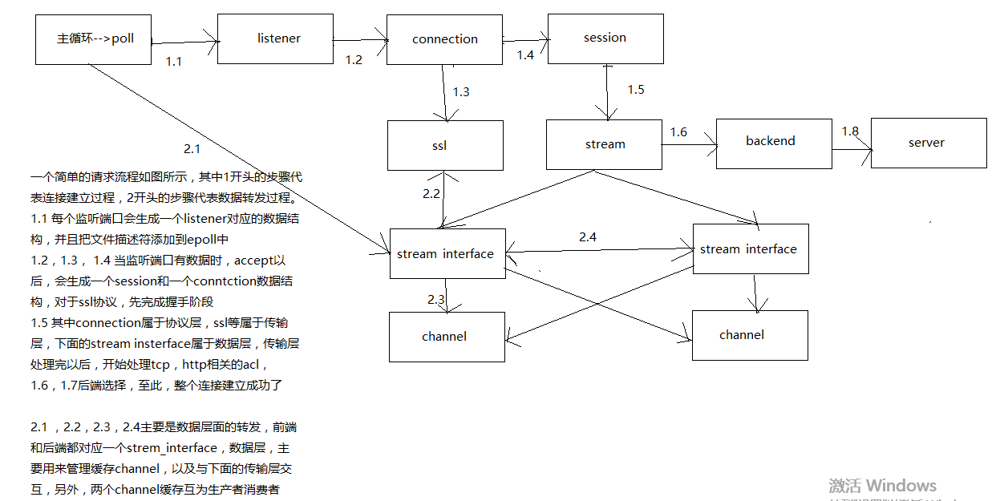

# Haproxy 模块划分
haproxy大概分为以下几个模块：

 - [启动流程](/2017/10/05/2017-10-05-haproxy-start/)
 - [acl/map解析](/2017/10/06/2017-10-06-haproxy-acl/)
 - [stick-table 原理](/2017/10/07/2017-10-07-haproxy-acl/)
 - [信号处理](/2017/10/08/2017-10-08-haproxy-signal/)
 - [时间处理](/2017/10/09/2017-10-09-haproxy-timer/)
 - [内存管理](/2017/10/10/2017-10-10-haproxy-memory/)
 - [后端server/健康检查](/2017/10/11/2017-10-11-haproxy-server/)
 - [cookie配置](/2017/10/12/2017-10-12-haproxy-cookie/)
 - ssl 处理 //未完成
 - 日志处理 //未完成

# 内部数据结构：
 


# 处理流程
从一个简单配置，简单说明http/tcp整个处理流程，以及整个代码设计的初衷：

## 配置文件
```
backend be
    mode http
    //假如没有找到netease的http头部，直接拒绝
    tcp-request content reject if !req.fhdr(netease)
    
    //添加http头部
    http-request set-header PROXY-BE be
    
    server server-1 192.168.0.5:80
    server server-2 192.168.0.6:80
    
    //假如存在http header server-1， 使用, 这个优先级比stick table高
    use_server server-1 if req.fhdr(server-1)
    
    //根据客户端地址，匹配后端server
    stick on src
    
    //在响应中添加头部
    http-response set header USE-HAPROXY-BE be 
frontend fe
    //http 模式
    mode http
    
    //绑定80端口, 使用ssl协议，后面接证书
    bind :443 ssl crt /usr/local/ssl/cert.pem
    
    //声明源地址为114.114.114.114的acl
    acl rule_forbidden src 114.114.114.114
    
    //在连接阶段，假如满足rule_forbidden条件，则拒绝这个连接
    tcp-request connection reject if rule_forbidden
    
    //http添加头部
    http-request set-header PROXY-FE fe
    
    //声明path是 /163yun 开头的acl
    acl acl_path path_beg /163yun
    
    //假如满足acl_path，则使用be这个后端
    use-backend be if acl_path
    
    http-response set header USE-HAPROXY-FE fe 
```

## 请求阶段
一个请求大概可以分为以下几个阶段：
```
front: 
    1 accept
    2 处理底层协议，例如ssl，proxy协议等
    3 处理tcp-request connection 相关的acl
    4 处理tcp-request content 相关的acl
    5 对于http协议，等待http头部
    6 处理http-request 相关的acl
    7 处理use_backend 后端选择的acl
backend:
    8 处理tcp_request content相关的acl
    9 处理http-request 相关的acl
    10 处理use-server相关的acl
    11 处理stick table相关的acl
    12 转发http或者tcp内容
    
响应可以分为一下几个阶段：
backend:
    1 处理tcp-response 相关的acl
    2 处理stick table 保存相关的acl
    3 处理http-response 相关的acl
    
frontend:
    4 处理http-resonse 相关的acl
    5 转发数据，http/tcp
    
```

## 代码实现：
```
    配置解析时，根据关键字backend和frontend，会生成两个proxy，分别是be，fe。具体到fe，
    所有的bind都会创建一个listenr， tcp-request为tcp请求的一些处理，
    http-request为http请求的一些处理，use-backend为后端选择的处理。 
    server为后端的一些管理，健康检查等。 当客户机连接到80端口以后，
    生成一个conntion结构，接着会生成一个session结构体，先处理tcp-request
    connection分为三层接口，首先是协议层，例如绑定，源地址获取等。
    其次是传输层，包括原生套接字的recv和ssl的recv等。然后是数据层，
    主要是与内存管理结合起来, stream生命周期从tcp连接开始，到断开结束。
    包含两个stream_interface，前端和后端。stream_interface与connection联系，
    到后面的正常数据传输阶段， connection的data层接口就和stream_interface相关了，
    例如connection可读时，先调用data接口，data接口就是si_conn_recv_cb,
    这个函数调用内存管理channel，获取可读大小，然后再回调connection的传输层，
    进行具体的数据读取。数据读取完以后，需要唤醒task，进行具体的业务处理。
    这时候connection会调用data层的wake函数，也就是stream_interface的si_conn_wake_cb函数，
    这个函数会进行数据转发， acl_cond判断，最重要的是，假如设置了唤醒task，
    就会进入process_stream函数，进行后端选择等。每个stream有两个channel，req，res，
    分别对应request和response的缓冲区，两者互为生产者和消费者。channel还负责管理超时时间，
    超时处理与task关联起来，在process_stream中处理。 
    channel和connection没有直接联系，都是通过stream_interface通知处理的。
    
    以上就是整个流程代码层面的流水账
```
