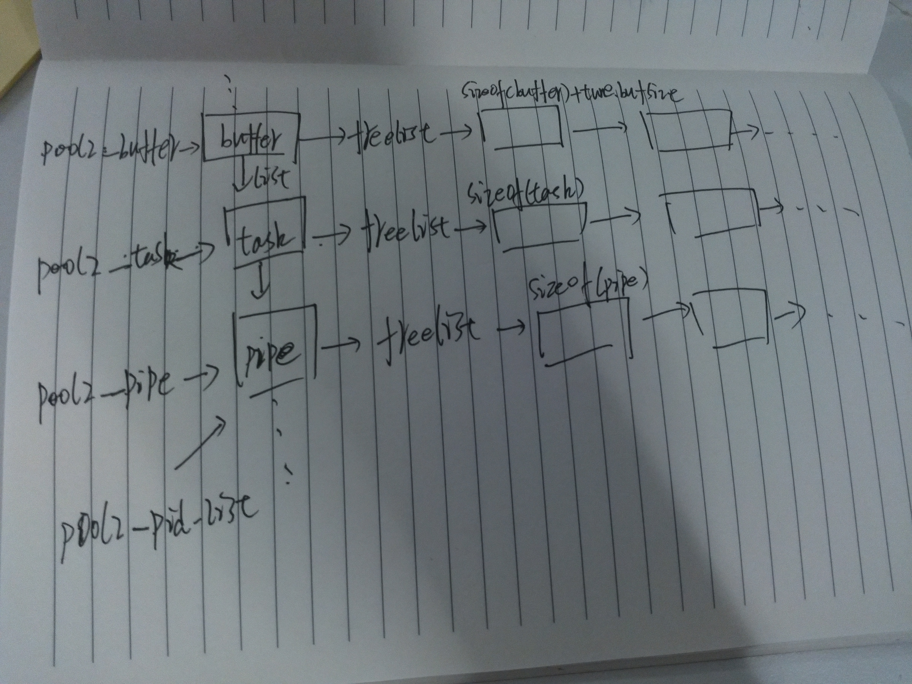

# Haproxy 内存管理
## 概述

haproxy的内存管理基本上可以参考 Linux 内核的kmem_cache和slab，模式大同小异。ha为大部分常用的数据结构
创建内存池，在程序初始化时，创建内存池。内存池的大概结构如下所示：



与buffer相关的配置：
    tune.buffers.reserve 低水位线，buffer内存池预先分配的内存，默认值是2，对于前端流接口，内存池需要达到低水位线才开始分配，否则认为内存不足，挂起task
    tune.buffers.limit 高水位线
    tune.bufsize 每个buffer的大小，默认值16K
    tune.maxrewrite buffer的预留空间，每个buffer都预留这么多内存，用于http head的改写和追加，
    默认值是1k，最大不超过tune.bufsize/2, 该空间不会一直保留，等到http头部分析完，
    就会拿出来作为普通缓存


## 数据结构
```
//内存池的数据结构
struct pool_head {
  void **free_list;
  struct list list; /* list of all known pools */
  unsigned int used;  /* how many chunks are currently in use */
  unsigned int allocated; /* how many chunks have been allocated */
  unsigned int limit; /* hard limit on the number of chunks */
  unsigned int minavail;  /* how many chunks are expected to be used */
  unsigned int size;  /* chunk size */
  unsigned int flags; /* MEM_F_* */
  unsigned int users; /* number of pools sharing this zone */
  char name[12];    /* name of the pool */
};

//接收和发送缓存，接收和发送方各一个
//data的大小可以在配置文件中用tune.bufsize设置
//缓存是一个循环队列
struct buffer {
  //buffer的开始位置
  char *p;                        /* buffer's start pointer, separates in and out data */
  //sizeof(buffer) + sizeof(data)
  unsigned int size;              /* buffer size in bytes */
  //i代表读取到的数据长度
  unsigned int i;                 /* number of input bytes pending for analysis in the buffer */
  //o代表可以转发的数据长度
  unsigned int o;                 /* number of out bytes the sender can consume from this buffer */
  //具体的数据存储位置
  char data[0];                   /* <size> bytes */
};

//接收和发送通道
struct channel {
  unsigned int flags;             /* CF_* */
  unsigned int analysers;         /* bit field indicating what to do on the channel */
  //缓存
  struct buffer *buf;   /* buffer attached to the channel, always present but may move */
  //假如使用splice的话，会使用pipe，一种零拷贝技术
  struct pipe *pipe;    /* non-NULL only when data present */
  //需要直接to_froward的字节数，例如http头部已经接收完了，根据http head内容就能
  //做acl判断，后续的body只是透明转发，不需要唤醒task做一些业务，所以直接设置to_forward的长度为
  //content-length，对于tcp，只要contion_rule执行完以后，就会设置to_forward为一个最大值，表示永远
  //都是做透明转发
  unsigned int to_forward;        /* number of bytes to forward after out without a wake-up */
  
  //统计相关
  unsigned short last_read;       /* 16 lower bits of last read date (max pause=65s) */
  unsigned char xfer_large;       /* number of consecutive large xfers */
  unsigned char xfer_small;       /* number of consecutive small xfers */
  unsigned long long total;       /* total data read */
  //超时相关
  int rex;                        /* expiration date for a read, in ticks */
  int wex;                        /* expiration date for a write or connect, in ticks */
  int rto;                        /* read timeout, in ticks */
  int wto;                        /* write timeout, in ticks */
  int analyse_exp;                /* expiration date for current analysers (if set) */
};

//一个stream中包含发送和接收通道
//struct stream {
    struct channel req;
    struct channel res;
    
    //接收和发送接口
    struct stream_interface si[2]; 
}
```

## 代码
```
ha的每种数据结构，都有独立的文件，.c文件中，基本上都会有init_xxx函数，例如buffer.c：
int init_buffer()
{
  void *buffer;
  //创建buffer的内存池，大小为buffer控制结构大小+实际数据大小，数据存储在buffer结构最后那个字段
  //data中，常见手法。指定MEM_F_SHARED后，两种大小相同的数据结构可以使用同一个内存池，
  //指定MEM_F_EXACT，16字节对齐
  pool2_buffer = 
    create_pool("buffer", sizeof (struct buffer) + global.tune.bufsize, MEM_F_SHARED|MEM_F_EXACT);
  if (!pool2_buffer)
    return 0;
  //指定buffer内存池的最小和最大内存
  pool2_buffer->minavail = MAX(global.tune.reserved_bufs, 3);
  if (global.tune.buf_limit)
    pool2_buffer->limit = global.tune.buf_limit;

  //分配保留内存
  buffer = pool_refill_alloc(pool2_buffer, pool2_buffer->minavail - 1);
  if (!buffer)
    return 0; 

  //释放保存到内存池中
  pool_free2(pool2_buffer, buffer);
  return 1;
}

//当有数据可读时，会回调下面的函数：
static void si_conn_recv_cb(struct connection *conn) {
    //根据conn的到stream_interface
    struct stream_interface *si = conn->owner;
    struct channel *ic = si_ic(si);
    
        //获取接收通道，每个stream都有发送/接收流接口stream_interface，存储在si[1]数组中
        //si[0] 是前端流接口，si[1]是后端流接口，对于前端stream_interface来说，
        //连接fd有数据可读时，写入stream->req中，fd有空间可写时，从stream->res中拿数据
        //stream->req 和 stream->res互为生产者和消费者
        static inline struct channel *si_ic(struct stream_interface *si)
        {           
            if (si->flags & SI_FL_ISBACK)     
                return &LIST_ELEM(si, struct stream *, si[1])->res;
            else
                return &LIST_ELEM(si, struct stream *, si[0])->req;
        }
   
    //对于支持pipe，并且设置了CF_KERN_SPLICING标记，并且需要转发的数据
    //大于MIN_SPLICE_FORWARD，使用splice传输，因为假如很少数据量转发，就没必要
    //创建一个pipe管道来传输数据了，因为splice同样涉及到两次系统调用，先调用splice将fd1的数据
    //缓存到管道，再调用一次splice将管道的数据拷贝到fd2的缓存。splice很多文档都说的是零拷贝
    //这个我还需要去看代码
    if (conn->xprt->rcv_pipe &&                                
        (ic->pipe || ic->to_forward >= MIN_SPLICE_FORWARD) && 
        ic->flags & CF_KERN_SPLICING) {          
        //调用rcv_pipe接口，转发最多ic->to_forward个数数据
        ret = conn->xprt->rcv_pipe(conn, ic->pipe, ic->to_forward);
    }
    
    //不满足使用splice条件的情况，使用buffer进行数据传输
    abort_splice:
        //分配buffer
        stream_alloc_recv_buffer:
            int stream_alloc_recv_buffer(struct channel *chn)
            {
                struct stream *s;
                struct buffer *b;
                int margin = 0;
                
                //假如是前端的通道channel，最少需要剩余两个buffer
                //因为不希望出现后端有数据而没有buffer可以使用的情况
                if (!(chn->flags & CF_ISRESP))
                    margin = global.tune.reserved_bufs;
                
                s = chn_strm(chn);
                
                b = b_alloc_margin(&chn->buf, margin);
                if (b)
                    return 1;
                
                //假如内存使用到buffer内存池的上限，把它挂到buffer_wait上面等待
                //当有空闲内存时，再唤醒task
                if (LIST_ISEMPTY(&s->buffer_wait))
                    LIST_ADDQ(&buffer_wq, &s->buffer_wait);
                return 0;
            }
            
        //获取buffer剩余缓冲，在http头部分析阶段，需要保留 global.tune.maxrewrite字节用于
        //rewrite操作，例如添加http头部，改写url等
        max = channel_recv_max(ic);
        
        //读取数据，并且设置 ic->buf->i += ret
        ret = conn->xprt->rcv_buf(conn, ic->buf, max);
        
        //当接收的数据需要用来分析，例如执行http头部的acl规则判断时，buf->i的值不会减少
        //每次读取数据都会增加，但是只做透明转发及设置to_forward时，会马上调用b_adv减少
        //buf->i的值，同时，增加buf->o的值，buf->o表示能马上转发的值
        //ic->to_forward的值也会减少，因为已经加到buf->o，认为是已经转发
        if (ic->to_forward && !(ic->flags & (CF_SHUTW|CF_SHUTW_NOW))) {
            unsigned long fwd = ret;
            if (ic->to_forward != CHN_INFINITE_FORWARD) {                             
                if (fwd > ic->to_forward)
                    fwd = ic->to_forward;                                  
                ic->to_forward -= fwd;
            }
            b_adv(ic->buf, fwd);
        }
}

//同样，后端fd可写时，会回调si_conn_send_cb，进一步调用si_conn_send
//该函数逻辑差不多，先判断能不能调用pipe，不支持时再调用snd_buf进行数据传输
static void si_conn_send(struct connection *conn)


//上面说过buf->i在http头部，或者是tcp的规则执行阶段，不会减少，所以当这个过程完成以后，
//就会设置buf->i为buf->o，即这些字段可以转发了，在process_stream函数中处理：

if (unlikely(!req->analysers &&
      !(req->flags & (CF_SHUTW|CF_SHUTR_NOW)) &&
      (si_f->state >= SI_ST_EST) &&
      (req->to_forward != CHN_INFINITE_FORWARD))) {
    
    //刷新buffer，把buf->i的值加到buf->o上，后续会把这些数据转发出去
    buffer_flush(req->buf);
    
    //设置req->to_forward 为一个最大值，后续的数据一直转发，特别对于tcp，不知道后面的
    //数据还有多少
    if (!(req->flags & (CF_SHUTR|CF_SHUTW_NOW)))
      channel_forward_forever(req);
  }


//还有上次在做连接数压力测试的时候，设置的buffer大小是16k，并且有心跳消息发送，
//但是ha占用的内存很小，理论上一个连接32K，但是整个进程占用的内存都很少，后面看代码发现：
//每次在读写完以后，会调用
stream_release_buffers：
    //对于接受和发送缓存，假如为空，会回收给内存池
    //然后可读的时候，又会重新分配缓存，但是因为使用内存池，所以基本上没什么消耗
    if (s->req.buf->size && buffer_empty(s->req.buf))                            
        b_free(&s->req.buf);
    if (s->res.buf->size && buffer_empty(s->res.buf))                              
        b_free(&s->res.buf);                                                                    
    
    //假如有stream正在等待内存，唤醒task
    if (!LIST_ISEMPTY(&buffer_wq))
        stream_offer_buffers();

```


  [1]: https://github.com/EastQ/images/blob/master/pool_image.jpg
