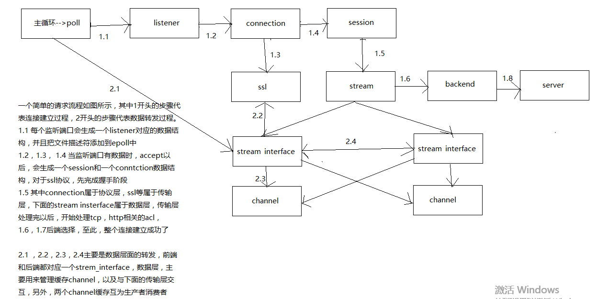
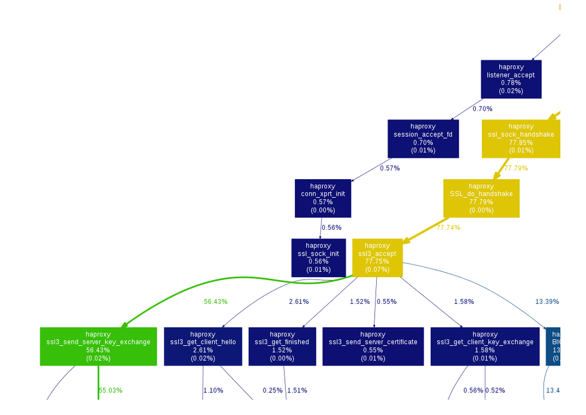
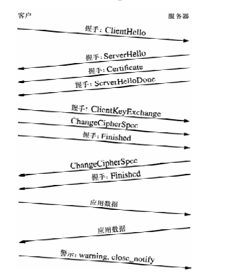
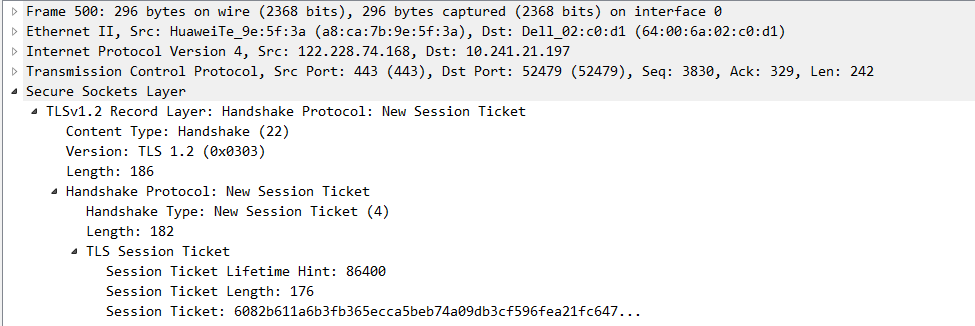
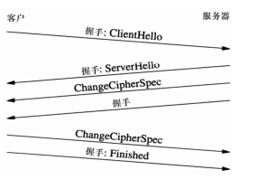
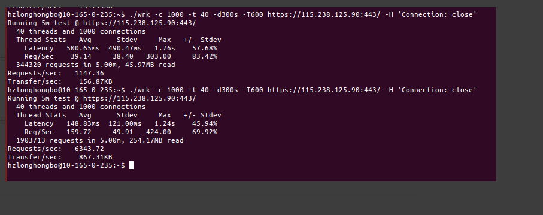
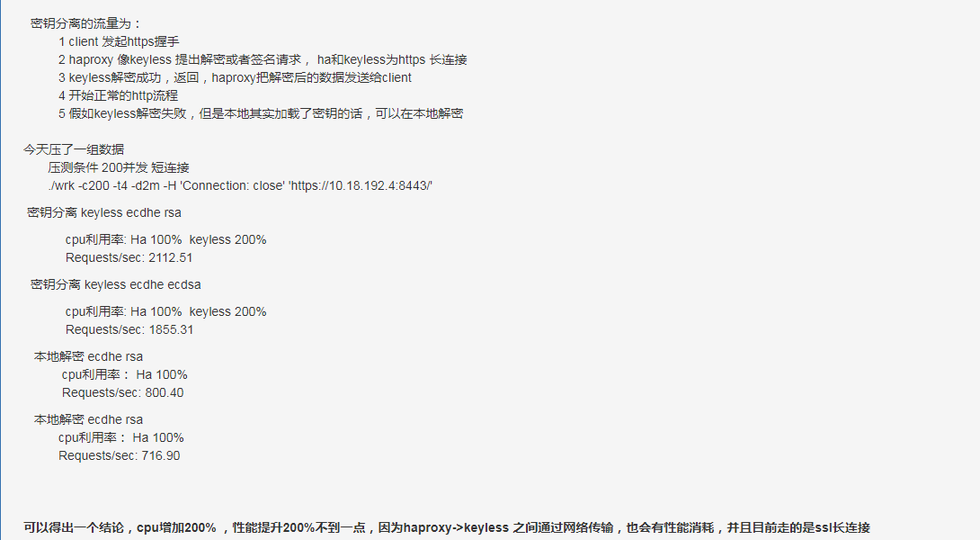
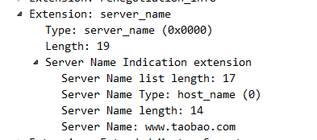
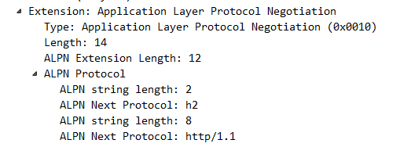
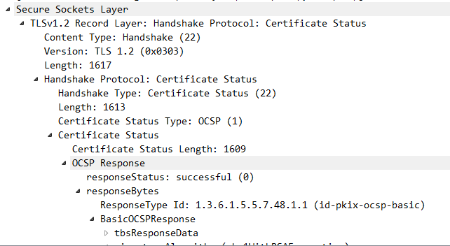

# 概述
&emsp;&emsp;市面上面最近动不动就出一个帖子，“某某公司的https优化”，当然https也是大势所趋，所以也写写我所了解的https相关的内容。  
&emsp;&emsp;对于https，对称加密的部分对性能的影响其实很小，所以优化的部分主要放在https的握手部分，第一次访问服务器的客户端来说，肯定需要经过一次完全握手，而完全握手最主要的性能消耗是在pre-master-key的生成， 这里涉及到大量的cpu计算，简单粗暴的理解，运算一个大数的一个大数次方加密，然后运算一个大数的一个大数次方解密。rsa加解密的过程大概是：    
&emsp;&emsp;假设需要加密的数据是m,公钥是(n,e)， 加密过程为:
 
 
 
&emsp;&emsp;加密数据为c，发送c给服务端，私钥为(n,d)， 解密过程为：  
    
   
    
&emsp;&emsp;rsa的数学原理可以参考这个链接：  
    
```
http://www.ruanyifeng.com/blog/2013/06/rsa_algorithm_part_one.html  
```
    
&emsp;&emsp;我用perf测试了使用ecdhe-ecdsa密钥交换签名算法的性能，小包，短连接，每次都是ssl完全握手，握手cpu占用78%，在握手部分，ecdsa签名占用50%以上。
 
# hsts    
&emsp;&emsp;https的好处很多，但是也需要用户配合，有的用户根本就不关心或者不了解https的好处，或者可能会习惯输入http://c.163.com，或者c.163.com，对于这种类型的输入，目前有个标准方案来强制用户使用https，这个就是HSTS（HTTP Strict Transport Security），hsts是在第一次通过https安全的访问服务端时，服务端在响应中添加http header：

```
    Strict-Transport-Security: max-age=31536000; includeSubDomains
```

&emsp;&emsp;浏览器会获取这个头部，存储到本地，下次用户在访问这个域名时，会使用https去访问，就算你输入http也会强转为https，这个http header分为最大有效期和是否标识子域名。chrome可以通过页面查询哪些域名支持hsts，或者删除

```
    chrome://net-internals/#hsts
```

&emsp;&emsp;上面说的第一个通过https安全访问服务端的意思是，证书必须要是合法的，并且和这个域名是对应的。另外，假如通过http访问，在响应中使用Strict-Transport-Security头部，浏览器会忽略掉。   
&emsp;&emsp; 所以hsts只能在用户访问一次https以后才能强制用户使用https，但是有的用户一直使用http，所以没有机会转到https，对于这种情况，可以使用域名跳转，用户访问80端口，直接返回302，跳转到https，但是这种情况，第一次访问因为是http访问，所以还是不安全的。还有一个解决方案就是把自己的域名放入hsts preload list，浏览器硬编码hsts preload list，申请条件和方法可以查看下面链接：

```
    https://hstspreload.org
```

# tls ticket    
&emsp;&emsp;下面说说减少握手部分的优化，业界常见的做法有两种，一个是session复用，一种是使用tls ticket，这两种方法的区别和http的session与cookie的区别一样，session复用是在服务端存储session 信息，客户端在下次请求时，带上session id，服务端在内存中找到对应的session 信息，复用之前的pre-master-key(占用cpu50%的那个)，握手完成，减少一个ttl，当然更多的是减少很多的cpu计算。这种方案的弊端就是服务端需要存储session 信息，很多实现都是多主模式，对于一个客户端，他的请求可能分配到多个主机上，这就涉及到session同步，代价比较大。    
&emsp;&emsp;另外一个模式就是tls ticket，服务器把会话信息通过另外一个密钥(和数据的对称加密密钥是两个)加密以后，把session信息传给客户端保存，这个信息就是tls ticket，客户端在下次访问的时候带上这个key，服务端解密以后，就可以复用之前的ssession信息了，这种方案只要保证各个服务器tls tieket密钥相同就可以了。当然，为了安全，tls ticket密钥需要不断更新，使用tls ticket以后，对于短链接，小包情况下，性能提升将近6倍。    
&emsp;&emsp;tls ticket的rfc文档，如下链接：


```
    https://tools.ietf.org/html/rfc5077
```
        
&emsp;&emsp;单纯rsa ssl完全握手流程:     

 
        
        
&emsp;&emsp; 支持tls ticket的话，服务端会额外发一个new session tlsticket的包：

      
        
        
&emsp;&emsp;tls ticket复用握手:    

  
        
    
&emsp;&emsp; 性能测试：         
    
 

        
&emsp;&emsp;与openssl结合使用时，可以通过设置SSL_CTX_set_tlsext_ticket_key_cb函数，设置tls ticket的回调函数，加解密都是同一个函数，这样就能保证多个主机使用同一个tls key加密密钥：
     
```
    SSL_CTX_set_tlsext_ticket_key_cb(ctx, ssl_tlsext_ticket_key_cb)
```
    
&emsp;&emsp; 使用tls ticket有利有弊，好处是简化了服务端，不需要设置session同步；坏处是需要设置为同一个tls key加密密钥，另外为了安全，tls ticket加密密钥需要不断的更新，替换。还有一个就是 session 复用属于tls标准，理论上所有浏览器都会支持，而tls ticket属于tls 扩展，不一定所有浏览器都支持，我测试了本地的ie浏览器是不支持tls ticket。    
&emsp;&emsp; 浏览器一般在关闭以后，就会释放ssl的缓存信息，所以，重新打开浏览器访问以后，就需要ssl完全握手。

# keyless
    
&emsp;&emsp;https完全握手，短链接get小包情况， ssl握手占到70%的cpu时间，我总共测试了目前比较常见的几种加密套件，包括ecdhe_rsa, ecdhe_ecdsa，rsa_rsa，其中50%的时间花在私钥的解密或者签名上面，所以，把私钥相关的计算剥离出来，用一个集群来计算，会很大程度上提升性能，毕竟云计算很大一部分原因就是通过超售来赚钱，当然，这种情况不能减少cpu的使用，甚至会增加访问的时延，只能通过集群，超售的模式来降低成本。私钥剥离出来有另外一个好处就是，就是业界常说的无密钥加载，也就是有的客户不希望泄露自己的私钥，但是又想要使用https，这时候可以客户可以自己搭建一个私钥计算服务器，第三方服务在涉及到密钥计算的时候，访问客户的服务器，完成私钥解密或者签名。对于客户的私钥计算环境搭建，已经有了一个开源实现：

```
    https://github.com/cloudflare/keyless
```

&emsp;&emsp;整个流程如下图所示：

 

       
&emsp;&emsp;具体的技术实现，openssl设置私钥计算的回调函数，加密套件不通，私钥计算的方式也不同，常见的ecdhe-rsa方式是在server-key-exchange中使用私钥，对于单纯的ras-rsa，是在client-key-exchange消息中使用私钥，在对应的地方调用回调函数进行私钥计算即可，为了性能考虑，肯定需要设计成异步非阻塞模式，所以需要保存当前握手函数内的上下文信息，目前我们poc使用的是openssl-1.0.2e版本， 服务端的握手主要修改s3_srvr.c中的ssl3_send_server_key_exchange和ssl3_get_client_key_exchange函数，当然需要定制一些错误码等。openssl我们尽量少修改源代码，对于具体的keyless访问，通过应用层代码来管理，会维持一个到keyless集群的连接池。这里可以使用ssl，也可以使用普通的tcp socket。这样设计主要是后续为了开放给用户使用的话，为了安全，使用ssl协议。内网自己搭建keyless集群的话，为了性能，可以是用裸tcp。超时管理等异常除以也放在应用层来做。目前nlb这边已经完成了基于openssl-1.0.2e/haproxy的异步无密钥模式poc验证。下面是具体的压测信息(下面图片有问题，3倍cpu只跑出来2.6倍的性能)：

 
 
      
&emsp;&emsp;关于硬件支持方面的调研还没有开始
# sni
&emsp;&emsp;下面说说https的一些特性       
&emsp;&emsp;sni主要用于在一个端口中绑定多个证书时，客户端在ssl的握手消息client hello中，通过tls扩展，发送域名信息，服务端获取返回域名对应的证书给客户，ssl抓包可以看到，如下信息：     

       
       
&emsp;&emsp;具体与openssl的技术实现，也是通过回调函数实现的，设置

```
        SSL_CTX_set_tlsext_servername_callback(ctx, ssl_sock_switchctx_cbk);
```
    
&emsp;&emsp;在应用层自己维护一个server_name与证书上下文的对应关系，回调以后，找到对应的上下文，设置到ssl连接中，在用户角度看来就是返回对应的证书给他。rfc文档如下地址：

```
       https://tools.ietf.org/html/rfc6066     
```
    
#  alpn
&emsp;&emsp;这协议的主要目的是在ssl层，协商上层http支持的协议，alpn是通过tls的扩展实现的，客户端在ssl握手阶段的client hello中发送自己支持的上层协议列表，服务端选择自己支持的协议，在server hello中返回，抓包信息如下：       
&emsp;&emsp;客户端发送协议列表，http2和http1.1      
     
 
    

&emsp;&emsp;服务端选择http1.1     
    
 
    

&emsp;&emsp;与openssl结合的具体实现，也是通过回调函数实现的，在回调函数中，根据客户端支持的协议列表，以及自己支持的协议列表，选择一个。      
    
```
      SSL_CTX_set_alpn_select_cb(ctx, ssl_sock_advertise_alpn_protos, bind_conf);
```
    
&emsp;&emsp;rfc文档：      
    
````
     https://tools.ietf.org/rfc/rfc7301.txt
````
    
# ocsp stapling
&emsp;&emsp;证书可能会吊销或者过期，所以浏览器需要知道证书的有效性，主要有两个方法来，一个CRL，证书吊销列表，浏览器定期去证书颁发机构获取这个列表，这个方法会慢慢导致吊销列表越来来大，并且实时性不高，另外一个方法是ocsp，在线证书状态监测，这个方法带来另外一个方法，会减慢页面加载速度。正是因为ocsp的这个缺点，出现了ocsp stapling，服务端预先从证书颁发机构获取证书状态，然后通过tls发送给客户端，客户端直接从扩展中获取证书的状态，当然，这个状态是经过上级ca签名的，无法伪造。haproxy会对每个pem证书文件，读取ocsp后缀的文件，从中获取ocsp响应，然后通过设置回调函数，
    
```
    SSL_CTX_set_tlsext_status_cb(ctx, ssl_sock_ocsp_stapling_cbk);
```
        
&emsp;&emsp;客户端在client hello中发送一个ocsp request的扩展      
     
      
     
&emsp;&emsp;服务端在发送证书状态以后，会发送一个ocsp响应的包             
     
      
          
&emsp;&emsp;因为ocsp响应的有效期只有几天，所以需要隔一段时间到证书颁发机构获取ocsp响应，下面的链接是配合haproxy使用的脚本链接：    
     
```
    http://www.jinnko.org/2015/03/ocsp-stapling-with-haproxy.html
```
     

      
# 总结
&emsp;&emsp;上面说的一些tls https的特性，都是nlb支持的，tls ticket，sni nlb已经默认支持；hsts提供运维接口设置，但是还没开放给外部用户；另外一些会根据产品需求或者性能方面的考虑，逐步上线， ocsp stapling, keyless等。另外还有一些小功能，如edh算法预先生成dh params, ecdhe预先生成椭圆曲线，动态生成证书，certificate transparency支持等。上面压测结果只是作为同等物理条件下两种不同方案的对比，不是线上的性能标准。
