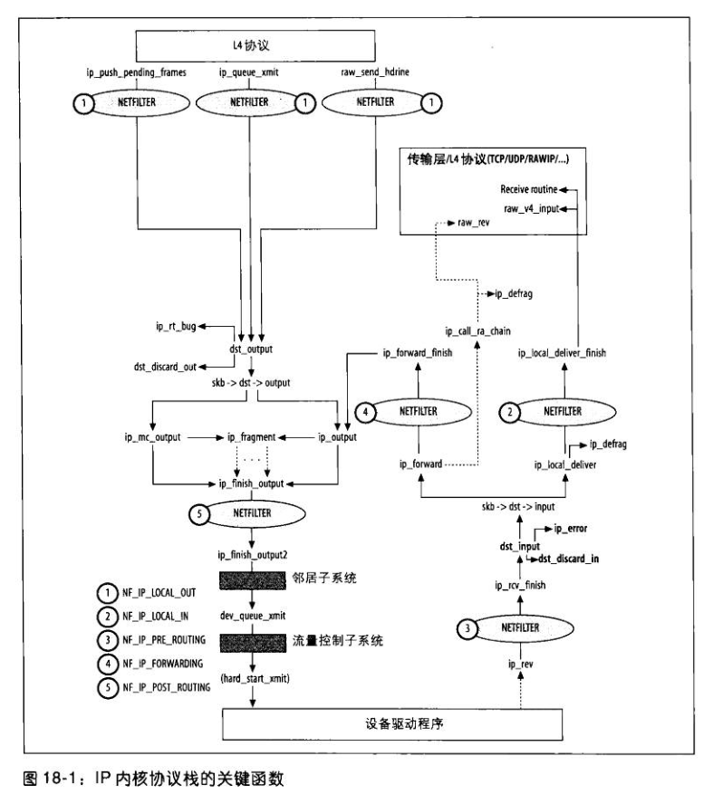

# 格式
  ip头部： ip首部长度20个字节，首部里面有个字段标识首部长度，4位，每位代表4个字节，4为最大表示15, 所以首部长度60个字节，除去20个字节固定长度，ip选项最长40个字节,
      ip校验和只适用于IP报头, 总长度用16位表示，单位是字节，包括报头

  ip选项格式： 
    type字段可以进一步分为三个部分，其中copied被设置时，假如需要分段，则需要把这个选项拷贝到每个片段, length表示整个选项的长度，point可以理解为当前的长度


  ip分段：
    ip头部有两个位用来表示分段相关，DF 禁止分段，MF后面还有分段, OFFSET表示原IP包的偏移量，13位,计算的时候需要左移三位(8字节对齐)
    ID字段是整个ip包都相同的，后续的重组需要使用这个字段。因为源路由根本就不知道有分段等因素，所以丢包的时候，只能把整个包都重新传输一遍，
    并且不会重用之前的ID。

    内核要识别一个片段所属的IP封包，内核会考虑下列参数：
      1 source ip, dest ip
      2 IP封包ID
      3 L4协议


  ip id生成：
      linux 为每个目的地IP地址使用一个计数器, 遇到NAT的时候，还是有可能重复，导致两个封包都丢弃。 ipv6只允许源头分段，中间路由器不允许分段


# 入口函数
ip层主要的处理函数如下图所示:
 
```
  int ip_rcv(struct sk_buff *skb, struct net_device *dev, 
          struct packet_type *pt, struct net_device *orig_dev)
  {
    struct iphdr *iph;
    u32 len;

    /* When the interface is in promisc. mode, drop all the crap
     * that it receives, do not try to analyse it.
     */
    当网卡处于混杂模式时，丢掉所有接收到的的垃圾数据，不要试图解析它

    if (skb->pkt_type == PACKET_OTHERHOST)
      goto drop;

    IP_INC_STATS_BH(IPSTATS_MIB_INRECEIVES);

    //假如引用计数大于1, 拷贝一份
    if ((skb = skb_share_check(skb, GFP_ATOMIC)) == NULL) {
      IP_INC_STATS_BH(IPSTATS_MIB_INDISCARDS);
      goto out;
    }

    //保证线性内存中的数据至少可以容纳ip报头大小
    if (!pskb_may_pull(skb, sizeof(struct iphdr)))
      goto inhdr_error;

    iph = skb->nh.iph;

    /*
     *  RFC1122: 3.1.2.2 MUST silently discard any IP frame that fails the checksum.
     *
     *  Is the datagram acceptable?
     *
     *  1.  Length at least the size of an ip header
     *  2.  Version of 4
     *  3.  Checksums correctly. [Speed optimisation for later, skip loopback checksums]
     *  4.  Doesn't have a bogus length
     */
    
    //ip头部至少是20个字节，版本只能等于4
    if (iph->ihl < 5 || iph->version != 4)
      goto inhdr_error;

    //保证ip选项在线性内存中
    if (!pskb_may_pull(skb, iph->ihl*4))
      goto inhdr_error;

    iph = skb->nh.iph;

    //校验ip头部检验和
    if (unlikely(ip_fast_csum((u8 *)iph, iph->ihl)))
      goto inhdr_error;

    //报文总长度
    len = ntohs(iph->tot_len);
    if (skb->len < len || len < (iph->ihl*4))
      goto inhdr_error;

    /* Our transport medium may have padded the buffer out. Now we know it
     * is IP we can trim to the true length of the frame.
     * Note this now means skb->len holds ntohs(iph->tot_len).
     */
    //删除可能填充的数据
    if (pskb_trim_rcsum(skb, len)) {
      IP_INC_STATS_BH(IPSTATS_MIB_INDISCARDS);
      goto drop;
    }

    //删除任何控制块碎片
    /* Remove any debris in the socket control block */
    memset(IPCB(skb), 0, sizeof(struct inet_skb_parm));

    //ROUTING相关的操作后面再看，最后会调用ip_rcv_finish
    return NF_HOOK(PF_INET, NF_IP_PRE_ROUTING, skb, dev, NULL,
             ip_rcv_finish);

  inhdr_error:
    IP_INC_STATS_BH(IPSTATS_MIB_INHDRERRORS);
  drop:
          kfree_skb(skb);
  out:
          return NET_RX_DROP;
  }

static inline int ip_rcv_finish(struct sk_buff *skb)
{
  struct iphdr *iph = skb->nh.iph;

  /*
   *  Initialise the virtual path cache for the packet. It describes
   *  how the packet travels inside Linux networking.
   */
  //路由相关，以后再介绍
  //如果无法路由，则会丢弃这个报文

  if (skb->dst == NULL) {
    int err = ip_route_input(skb, iph->daddr, iph->saddr, iph->tos,
           skb->dev);
    if (unlikely(err)) {
      if (err == -EHOSTUNREACH)
        IP_INC_STATS_BH(IPSTATS_MIB_INADDRERRORS);
      goto drop;
    }
  }

#ifdef CONFIG_NET_CLS_ROUTE
  if (unlikely(skb->dst->tclassid)) {
    struct ip_rt_acct *st = ip_rt_acct + 256*smp_processor_id();
    u32 idx = skb->dst->tclassid;
    st[idx&0xFF].o_packets++;
    st[idx&0xFF].o_bytes+=skb->len;
    st[(idx>>16)&0xFF].i_packets++;
    st[(idx>>16)&0xFF].i_bytes+=skb->len;
  }
#endif

  //如果ip首部大于20个字节，则知道里面有选项需要处理，调用ip_rcv_options处理
  if (iph->ihl > 5 && ip_rcv_options(skb))
    goto drop;

  return dst_input(skb);

drop:
        kfree_skb(skb);
        return NET_RX_DROP;
}
```

# ip选项处理
ip选项处理的主要函数如下图所示:
 

```
static inline int ip_rcv_options(struct sk_buff *skb)
{
  struct ip_options *opt;
  struct iphdr *iph;
  struct net_device *dev = skb->dev;

  /* It looks as overkill, because not all
     IP options require packet mangling.
     But it is the easiest for now, especially taking
     into account that combination of IP options
     and running sniffer is extremely rare condition.
                --ANK (980813)
  */
  //cow(copy on write) 写时复制, 因为选项处理可能会修改skb数据，所以假如存在共享的情况则先拷贝一份
  if (skb_cow(skb, skb_headroom(skb))) {
    IP_INC_STATS_BH(IPSTATS_MIB_INDISCARDS);
    goto drop;
  }

  iph = skb->nh.iph;

  //真正的ip 选项处理函数
  //假如ip选项格式错误，对于接收的报文，会返回icmp报文
  //http://blog.csdn.net/qy532846454/article/details/7498536

  if (ip_options_compile(NULL, skb)) {
    IP_INC_STATS_BH(IPSTATS_MIB_INHDRERRORS);
    goto drop;
  }

  opt = &(IPCB(skb)->opt);
  if (unlikely(opt->srr)) {
    //检查设备是否支持ip源路由
    //如果这个选项被关闭，则报文被丢弃，没有icmp产生
    struct in_device *in_dev = in_dev_get(dev);
    if (in_dev) {
      if (!IN_DEV_SOURCE_ROUTE(in_dev)) {
        if (IN_DEV_LOG_MARTIANS(in_dev) &&
            net_ratelimit())
          printk(KERN_INFO "source route option "
                 "%u.%u.%u.%u -> %u.%u.%u.%u\n",
                 NIPQUAD(iph->saddr),
                 NIPQUAD(iph->daddr));
        in_dev_put(in_dev);
        goto drop;
      }

      in_dev_put(in_dev);
    }

    if (ip_options_rcv_srr(skb))
      goto drop;
  }

  return 0;
drop:
  return -1;
}
```
