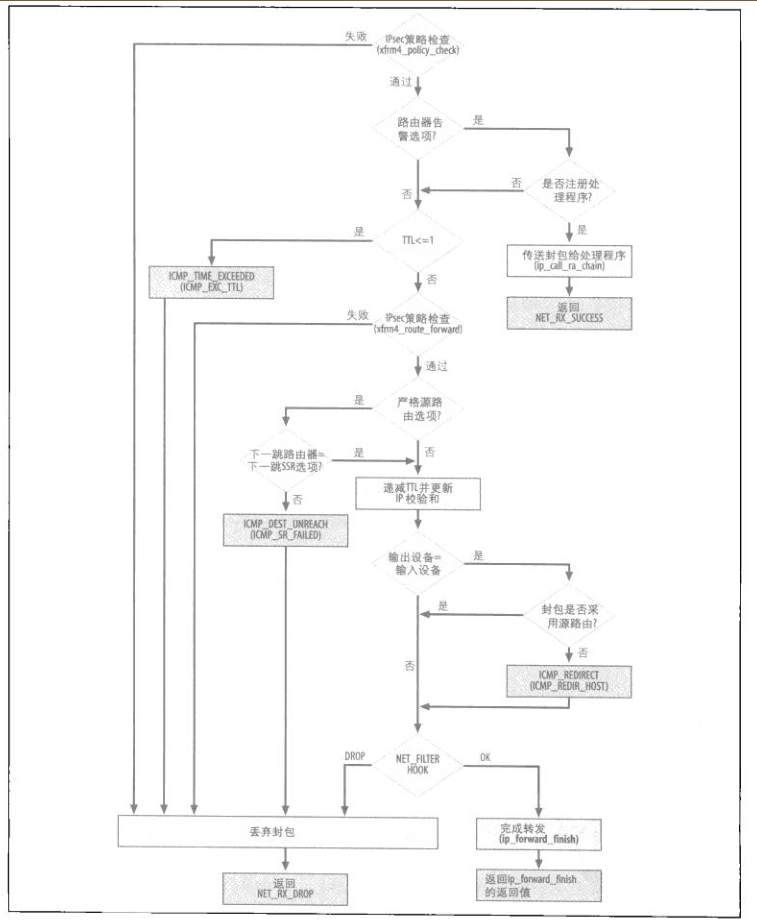

# 转发
  在ip_rcv_finish函数中，或者在处理源路由选项时，会调用路由查询函数，假如不是发往本地的话，dst_input里面调用的是ip_forward, 该函数的流程如下所示：
  
  
  假如指定了源路由选项，但是下一跳地址不是源路由指定的地址，则发送icmp错误报文
  假如遇到更加合适的路径，并且没有指定源路由选项，会发送路由重定向选项
  最后会经过netfilter， 然后调用ip_forward_finish函数， 此时netfilter的选项是NF_IP_FORWARD, 之前在ip_rcv中，选项是NF_IP_PRE_ROUTING

 ``` 
 static inline int ip_forward_finish(struct sk_buff *skb)
{
  struct ip_options * opt = &(IPCB(skb)->opt);

  IP_INC_STATS_BH(IPSTATS_MIB_OUTFORWDATAGRAMS);

  //填充ip选项， 主要是之前在标记的需要填充的字段，包括ip记录，以及源路由选项
  if (unlikely(opt->optlen))
    ip_forward_options(skb);

  return dst_output(skb);
} 
```


所有的传输都会通过dst_output， dstoutput会调用虚拟函数output, 对于单播来说，会初始化为ip_output，如果是多播，会调用ip_mc_output，分段也在这两个函数内处理，最后会调用ip_finish_output来关联邻居子系统

# 本地传递

  假如路由得知本地主机是封包的目的地，会初始化input为ip_local_deliver，ip_local_deliver函数会先处理分段相关的逻辑, 分段一般只有udp，icmp等协议使用，因为tcp协议有自己的mss，基本上就是使用MTU大小

```
  int ip_local_deliver(struct sk_buff *skb)
  {
    /*
          *  Reassemble IP fragments.
             */

    //设置了MF标志，代表是ip分组片段，新进去重组流程
    if (skb->nh.iph->frag_off & htons(IP_MF|IP_OFFSET)) {
          skb = ip_defrag(skb, IP_DEFRAG_LOCAL_DELIVER);
              if (!skb)
                      return 0;
                }

    //经过netfilter模块以后，进去ip_local_deliver_finish函数

      return NF_HOOK(PF_INET, NF_IP_LOCAL_IN, skb, skb->dev, NULL,
                     ip_local_deliver_finish);
  }
```

## ip分段重组
  收到ip分段，肯定需要先保存，直到所有分段都已经收到时，就投递给上层协议; 或者超时以后，定时器触发回收流程，并且发送icmp错误给源端;
  在本地组包数据结构，如图所示：

```
/* Process an incoming IP datagram fragment. */
struct sk_buff *ip_defrag(struct sk_buff *skb, u32 user)
{
  struct iphdr *iph = skb->nh.iph;
  struct ipq *qp;
  struct net_device *dev;

  IP_INC_STATS_BH(IPSTATS_MIB_REASMREQDS);

  /* Start by cleaning up the memory. */
  //整个分组内存大于这个值时，会释放一部分老的内存，LRU算法
  if (atomic_read(&ip_frag_mem) > sysctl_ipfrag_high_thresh)
    ip_evictor();

  dev = skb->dev;

  /* Lookup (or create) queue header */
  //查询之前分组，主键是id, saddr, daddr, protocol
  //假如没有查询到，则会创建一个新的qp数据结构，
  //并且插入到hash表里面，并且设置超时时间
  if ((qp = ip_find(iph, user)) != NULL) {
    struct sk_buff *ret = NULL;

    spin_lock(&qp->lock);

    ip_frag_queue(qp, skb);

    if (qp->last_in == (FIRST_IN|LAST_IN) &&
        qp->meat == qp->len)
      ret = ip_frag_reasm(qp, dev);

    spin_unlock(&qp->lock);
    ipq_put(qp, NULL);
    return ret;
  }

  IP_INC_STATS_BH(IPSTATS_MIB_REASMFAILS);
  kfree_skb(skb);
  return NULL;
}
```
