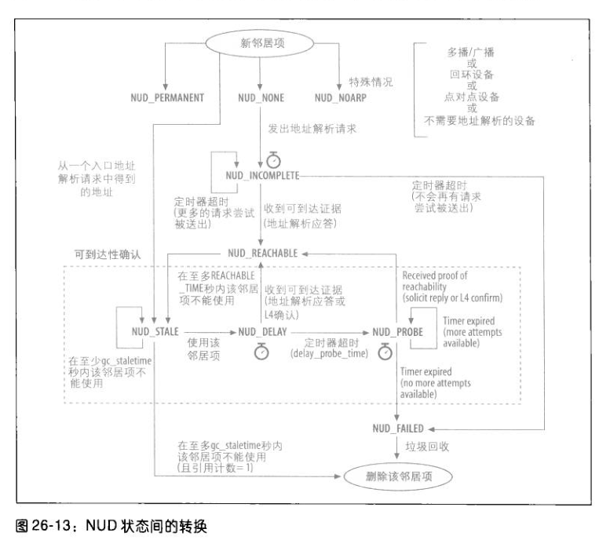
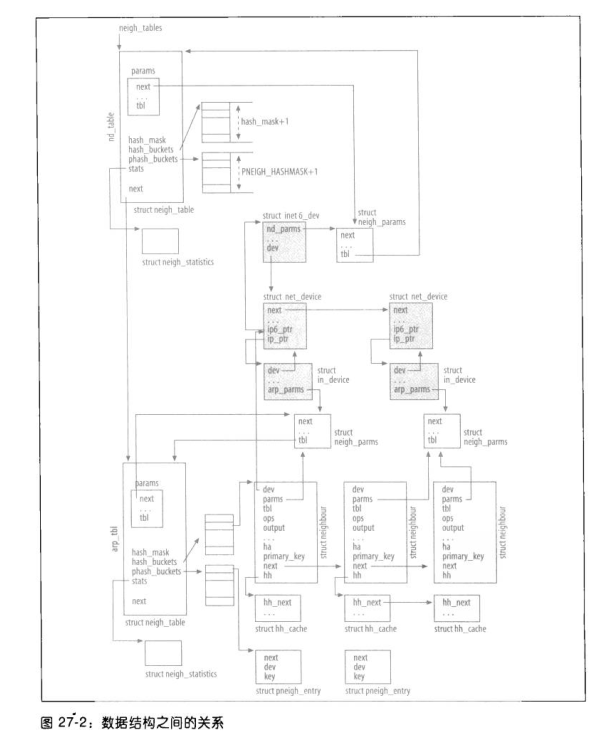

# 基础
  当请求的地址和本机地址属于同一个逻辑子网时，才会发送solicitation请求，假如不属于同一个子网时，对路由器进行地址解析
  当请求解析的地址和配置在接收该solicitation请求的nic上的l3地址属于同一个逻辑子网时，linux才会应答这个solicitation请求

# 状态转移
  邻居状态转移如下图所示：
  

  假如邻居状态是NUD_REACHABLE, 但是在一段时间内没有进行确认了，然后状态会变成NUD_STALE, 这时候假如有包要发送，状态会变成NUD_DELAY
  , 在这个状态下，收到地址解析应答或者l4的包确认，则会转变成NUD_REACHABLE, 假如超时，没有收到任何确认，会转变成NUD_PROBE, 然后
  再重新发送solicitation请求

  邻居子系统数据结构如下图所示：
  

# 大体流程
  邻居子系统的通用接口主要与邻居的状态和设置驱动有关系, 大体流程为：
    进行路由查询时，会调用arp_bind_neighbour函数，绑定路由缓存和arp邻居信息
    接下来进去邻居子系统，调用__neigh_lookup_errno查找邻居信息，key是网关的地址，也就是下一跳的ip地址。

    调用neigh_lookup查找，能查找直接返回，不能查找到，调用neigh_create创建邻居信息
    neigh_create会调用arp_constructor构造函数初始化

    arp_constructor函数中，对于多播，广播，回环，直接设置相应的地址，返回，所以回环也是需要经过邻居子系统的，以太网的初始化，因为有dev_hard_cache回调函数，直接设置

      neigh->ops = &arp_hh_ops

    因为当前arp的nud_state 不是valid，设置为：
      neigh->output = neigh->ops->output;

    也有可能设置为：
      neigh->output = neigh->ops->connected_output; 

    到这里，邻居信息就创建完成了，接下来
    路由会调用__neigh_event_send发送arp信息，具体是在该函数中设置定时器
    neigh_add_timer(neigh, now + 1);

    在ip_output_finish函数中，会调用neigh->output，发送数据包，然后调用
    neigh->ops->solicit(neigh, skb);
    arp_solicit函数调用arp_send进行发送
    arp_send会创建arp包，然后调用arp_xmit，arp_xmit再调用dev_queue_xmit发送出去

    arp_rcv接收arp包，处理完验证消息以后，调用arp_process处理 
    如上图所示， 假如设备驱动支持l2帧缓存，在ip_finish_output2函数中，直接就会拷贝2层头部到skb，不会再去查询neigh表, l2缓存与一条路由缓存记录关联

# 配置参数

    在云计算环境中，特别是lxc物理机中，需要调整gc_thresh参数，当neighbour实例大于gc_thresh3时，neigh_alloc轻质执行垃圾回收，如果介于gc_thresh2和gc_thresh3之间， 并且若上次垃圾回收已经过去5s, 那么也执行垃圾回收。假如这个值设置得很少，有可能ping loclhost都会延迟很大, 当neighbour实例个数大于gc_thresh1时，执行异步回收操作

    linux 中， ip属于主机，而不是属于某张网卡

    arp_announce选项：
    当产生solicitation请求的主机有多个ip时，这个选项控制哪个地址应该放到solicitation请求的arp头中
      0 任何本地地址都可以
      1 如果可能，选择和目的地址位于统一子网内的地址，否则使用级别2的结果
      2 优先使用主地址

    arp_ignore:
      0 对任何本地地址的arp请求都应答
      1 如果目的ip配置在收到ARP请求的接口上才应答
      2 和1 值类似，但是源ip必须和目的IP属于同一个子网
      3 如果目的IP的scope不是本地主机才应答
      8 不应答

    
    
    
    

