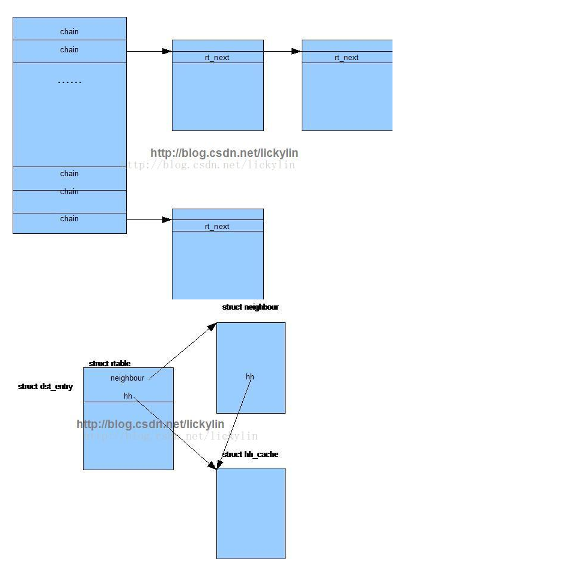
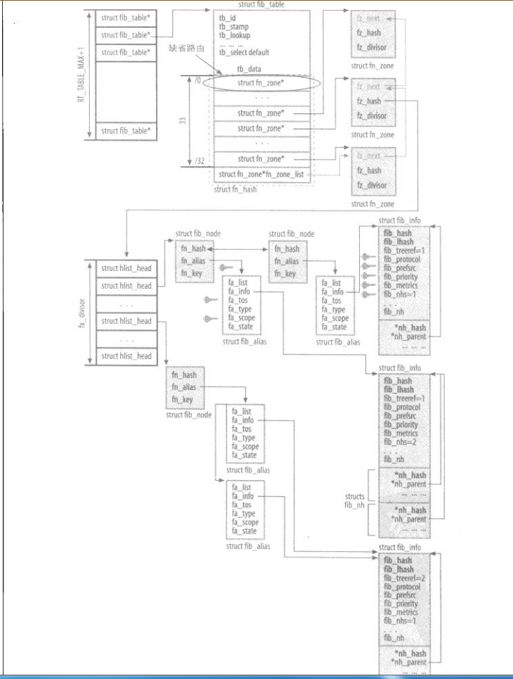

# 基础
  地址scope
  本地：
    只能在主机内部使用的地址，scope是local

  子网：
    只能在局域网内使用的地址，scope是link

  全域：
    能在全部范围内使用的地址，scope是global

  路由scope:
  本地:
    路由的目的地址是本地的， 则scope是local

  子网:
    路由的目的地址是子网的， 则scope是link
  全域:
    路由的目的地址是全域范围的， 则scope是global

  如果一个网卡有两个ip地址，并且两个ip地址属于同一个子网，那么先配置的地址是主地址，后配置的是辅助地址

  假如为一个网卡添加别名网卡，别名网卡的地址与主网卡属于同一个子网时，别名网卡为辅助ip地址

  辅助地址和主地址的区别在于： 当主机为本地生成的流量选择源ip时，只考虑主地址

  路由匹配优先级：
    首先是最佳前缀匹配，前缀相同时，根据tos来区分，最后通过主次地址区分

  多路径路由的流量分配是以路由缓存表项的数量来衡量, 因为一旦选择了下一跳，就像缓存内添加一条表项，路由子系统总是先查路由缓存，然后再查询路由表

# 路由缓存
  涉及到路由查找的时候，都是先查询路由缓存，假如路由缓存不存在时，才会查询路由表, 路由缓存数据结构如下所示：
    

  
  路由缓存hash的key是由daddr, saddr, 设备，tos组成。 默认情况下，路由缓存永远不会过期，但是假如遇到路由重定向，或者地址不可达等icmp报文时，就会
  删除缓存。当然缓存内存过多也会删除。

# 路由表
  ## 路由表数据结构
  路由表的数据结构如下图所示:
    

  linux系统中可以存在多个路由表，所有路由表在一个数组中，单个路由表中，有33个hash链表，分别代表目的子网掩码的长度, 其中子网掩码长度为0代表默认路由。
  子网掩码长度相同的hash链表用fn_zone表示，该hash表的每个项代表相同的子网。对于子网不同时hash冲突的情况，用链表连接起来。也就是说fn_zone表示一个单独的子网。
  对于目子网相同的不同路由，共享同一个fib_node。每条路由都有自己的fib_alias， fib_alias按照tos递增排序。下一跳网关的地址通过fib_info保存。所有的fib_info
  也通过hash链接起来。
  
  ## 路由查找
    ip_queuq_xmit等函数调用ip_route_output_flow
      ip_route_output_flow函数调用__ip_route_output_key
        __ip_route_output_key中先查找路由缓存，假如路由缓存不存在，再调用
	  ip_route_output_slow。
	    判断特殊情况，直接构建路由
	    非特殊情况，调用fib_lookup
	    fib_lookup调用fib_rules_lookup:
	    针对每个rule，调用其match函数匹配，其中ipv4对应的虚函数组是fib4_rules_ops
	    fib4_rule_match主要判断src，dst，tos是否相等
	    fib4_rule_action根据策略设置的动作，假如动作是FR_ACT_TO_TBL，查找路由表
	    对于ipv4的路由表来说，调用的函数是fn_hash_lookup

  	   fn_hash_lookup： 
	     首先根据前缀，查找zone，然后调用fib_semantic_match查找网关信息
	     fib_semantic_match函数：
	       判断tos，然后再判断网关的fib_flags是否等于RTNH_F_DEAD，然后再判断路由是否可达，根据fa_type判断，假如没有指定出口，就用第一个匹配的网关，否则，判断出口网卡是否相等
     回到ip_route_output_slow：
	假如没有指定出口ip，直接调用FIB_RES_PREFSRC查找出口ip，假如该网关指定了出口网卡，判断出口ip和目标ip是否在一个网段，否则从所有网卡中选取一块网卡，这块网卡的路由类型不是RT_SCOPE_LINK，并且scope小于用户设置的scope
	假如没有指定出口网卡，和此类似。
	接下来，把路由信息保存到路由缓存中     
  
