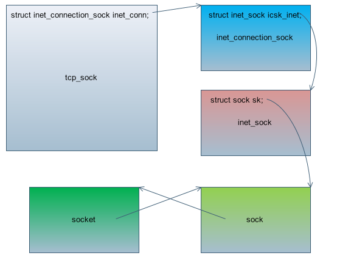
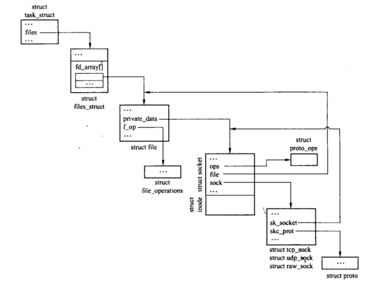

# 用户态到内核态socket调用过程
基本上都是网上搜集的资料，这块没有经过验证, 大概流程如下：
1 用户态调用socket函数，进入glibc库
2 每个系统调用都有一个对应的编号，glibc把socket对应的系统调用号写入寄存器，并且触发系统调用软中断
3 软中断开始处理，内核开始处理，然后拿到系统调用编号，找到对应的函数，进入sys_socket函数, 开始创建socket

# socket创建内核态操作流程
## 代码流水帐
```
    asmlinkage long sys_socket(int family, int type, int protocol)
    {
        int retval;
        struct socket *sock;

        //创建一个socket和fd对应的结构体
        retval = sock_create(family, type, protocol, &sock);
        if (retval < 0) 
            goto out; 

        //创建一个文件，挂载到socket之前的虚拟文件系统，
        retval = sock_map_fd(sock);
        if (retval < 0) 
            goto out_release;

    out:
        /* It may be already another descriptor 8) Not kernel problem. */
        return retval;

    out_release:
        sock_release(sock);
        return retval;
    }

    int sock_create(int family, int type, int protocol, struct socket **res)
    {
        return __sock_create(family, type, protocol, res, 0);
    }

    static int __sock_create(int family, int type, int protocol, struct socket **res, int kern)
    {
        // 这里我的理解就是检查进程有没有权限创建socket
        err = security_socket_create(family, type, protocol, kern);
        //调用socket虚拟文件系统，分配inode
        if (!(sock = sock_alloc()))

        //调用inet_create, 至于net_families在系统初始化阶段已经注册了PF_INET协议簇
        if ((err = net_families[family]->create(sock, protocol)) < 0)
    }

    static int inet_create(struct socket *sock, int protocol)
    {
        sock->ops = answer->ops;
        answer_prot = answer->prot;
        answer_no_check = answer->no_check;
        answer_flags = answer->flags;

        //假如创建的SOCK_STREAM类型, 这里返回的其实是tcp_sock函数
        //tcp_sock里面包含了inet_connection_sock, 里面包含了inet_sock, inet_sock 里面包含了sock, 并且都是结构体第一个
        //字段，所以可以强转
        sk = sk_alloc(PF_INET, GFP_KERNEL, answer_prot, 1);

        //初始化sock相关的数据, 包括几个队列, 缓存大小等。
        sock_init_data(sock, sk);

        sk->sk_destruct    = inet_sock_destruct;
        sk->sk_family      = PF_INET;
        sk->sk_protocol    = protocol;
        sk->sk_backlog_rcv = sk->sk_prot->backlog_rcv;

        if (sk->sk_prot->init) {
            //对于tcp这里调用的是tcp_v4_init_sock， 缓存大小在这里设置
            err = sk->sk_prot->init(sk);
            if (err)
                sk_common_release(sk);
            }
        }
    }
```

struct proto_ops 完成系统调用到传输层的映射, struct proto则从传输层映射到网络层
tcp sock之间的关系，如下图所示:


套机字和文件描述符之间的关系:


# 数据结构
```
//最外层socket数据结构
struct socket {
    socket_state        state;
    unsigned long       flags;
    const struct proto_ops  *ops;
    struct fasync_struct    *fasync_list;
    struct file     *file;
    //套接字的网络层接口
    struct sock     *sk;
    wait_queue_head_t   wait;

    //type 表示SOCK_STREAM或者SOCK_DGRAM
    short           type;
};

struct sock {
    /*   
     * Now struct inet_timewait_sock also uses sock_common, so please just
     * don't add nothing before this first member (__sk_common) --acme
     */
    struct sock_common  __sk_common;
    #define sk_family       __sk_common.skc_family
    #define sk_state        __sk_common.skc_state
    #define sk_reuse        __sk_common.skc_reuse
    #define sk_bound_dev_if     __sk_common.skc_bound_dev_if
    #define sk_node         __sk_common.skc_node
    #define sk_bind_node        __sk_common.skc_bind_node
    #define sk_refcnt       __sk_common.skc_refcnt
    #define sk_hash         __sk_common.skc_hash
    #define sk_prot         __sk_common.skc_prot
    unsigned char       sk_shutdown : 2, 
                sk_no_check : 2, 
                sk_userlocks : 4; 
    unsigned char       sk_protocol;
    unsigned short      sk_type;
    int         sk_rcvbuf;
    socket_lock_t       sk_lock;
    wait_queue_head_t   *sk_sleep;
    struct dst_entry    *sk_dst_cache;
    struct xfrm_policy  *sk_policy[2];
    rwlock_t        sk_dst_lock;
    atomic_t        sk_rmem_alloc;
    atomic_t        sk_wmem_alloc;
    atomic_t        sk_omem_alloc;
    struct sk_buff_head sk_receive_queue;
    struct sk_buff_head sk_write_queue;
    struct sk_buff_head sk_async_wait_queue;
    int         sk_wmem_queued;
    int         sk_forward_alloc;
    gfp_t           sk_allocation;
    int         sk_sndbuf;
    int         sk_route_caps;
    int         sk_gso_type;
    int         sk_rcvlowat;
    unsigned long       sk_flags;
    unsigned long           sk_lingertime;
    /*   
     * The backlog queue is special, it is always used with
     * the per-socket spinlock held and requires low latency
     * access. Therefore we special case it's implementation.
     */
    struct {
        struct sk_buff *head;
        struct sk_buff *tail;
    } sk_backlog;
    struct sk_buff_head sk_error_queue;
    struct proto        *sk_prot_creator;
    rwlock_t        sk_callback_lock;
    int         sk_err,
                sk_err_soft;
    unsigned short      sk_ack_backlog;
    unsigned short      sk_max_ack_backlog;
    __u32           sk_priority;
    struct ucred        sk_peercred;
    long            sk_rcvtimeo;
    long            sk_sndtimeo;
    struct sk_filter        *sk_filter;
    void            *sk_protinfo;
    struct timer_list   sk_timer;
    struct timeval      sk_stamp;
    struct socket       *sk_socket;
    void            *sk_user_data;
    struct page     *sk_sndmsg_page;
    struct sk_buff      *sk_send_head;
    __u32           sk_sndmsg_off;
    int         sk_write_pending;
    void            *sk_security;
    void            (*sk_state_change)(struct sock *sk);
    void            (*sk_data_ready)(struct sock *sk, int bytes);
    void            (*sk_write_space)(struct sock *sk);
    void            (*sk_error_report)(struct sock *sk);
    int         (*sk_backlog_rcv)(struct sock *sk,
                          struct sk_buff *skb);
    void                    (*sk_destruct)(struct sock *sk);
};

struct sock_common {
    unsigned short      skc_family;
    volatile unsigned char  skc_state;
    unsigned char       skc_reuse;
    int         skc_bound_dev_if;
    struct hlist_node   skc_node;
    struct hlist_node   skc_bind_node;
    atomic_t        skc_refcnt;
    unsigned int        skc_hash;
    struct proto        *skc_prot;
};

struct tcp_sock {
    /* inet_connection_sock has to be the first member of tcp_sock */
    struct inet_connection_sock inet_conn;
    int tcp_header_len; /* Bytes of tcp header to send      */

/*
 *  Header prediction flags
 *  0x5?10 << 16 + snd_wnd in net byte order
 */
    __u32   pred_flags;

/*
 *  RFC793 variables by their proper names. This means you can
 *  read the code and the spec side by side (and laugh ...)
 *  See RFC793 and RFC1122. The RFC writes these in capitals.
 */
    __u32   rcv_nxt;    /* What we want to receive next     */
    __u32   snd_nxt;    /* Next sequence we send        */

    __u32   snd_una;    /* First byte we want an ack for    */
    __u32   snd_sml;    /* Last byte of the most recently transmitted small packet */
    __u32   rcv_tstamp; /* timestamp of last received ACK (for keepalives) */
    __u32   lsndtime;   /* timestamp of last sent data packet (for restart window) */

    /* Data for direct copy to user */
    struct {
        struct sk_buff_head prequeue;
        struct task_struct  *task;
        struct iovec        *iov;
        int         memory;
        int         len;
#ifdef CONFIG_NET_DMA
        /* members for async copy */
        struct dma_chan     *dma_chan;
        int         wakeup;
        struct dma_pinned_list  *pinned_list;
        dma_cookie_t        dma_cookie;
#endif
    } ucopy;

    __u32   snd_wl1;    /* Sequence for window update       */
    __u32   snd_wnd;    /* The window we expect to receive  */
    __u32   max_window; /* Maximal window ever seen from peer   */
    __u32   mss_cache;  /* Cached effective mss, not including SACKS */
    __u16   xmit_size_goal; /* Goal for segmenting output packets   */
    /* XXX Two bytes hole, try to pack */

    __u32   window_clamp;   /* Maximal window to advertise      */
    __u32   rcv_ssthresh;   /* Current window clamp         */
    __u32   frto_highmark;  /* snd_nxt when RTO occurred */
    __u8    reordering; /* Packet reordering metric.        */
    __u8    frto_counter;   /* Number of new acks after RTO */
    __u8    nonagle;    /* Disable Nagle algorithm?             */
    __u8    keepalive_probes; /* num of allowed keep alive probes   */

/* RTT measurement */
    __u32   srtt;       /* smoothed round trip time << 3    */
    __u32   mdev;       /* medium deviation         */
    __u32   mdev_max;   /* maximal mdev for the last rtt period */
    __u32   rttvar;     /* smoothed mdev_max            */
    __u32   rtt_seq;    /* sequence number to update rttvar */

    __u32   packets_out;    /* Packets which are "in flight"    */
    __u32   left_out;   /* Packets which leaved network */
    __u32   retrans_out;    /* Retransmitted packets out        */
/*
 *      Options received (usually on last packet, some only on SYN packets).
 */
    struct tcp_options_received rx_opt;

/*
 *  Slow start and congestion control (see also Nagle, and Karn & Partridge)
 */
    __u32   snd_ssthresh;   /* Slow start size threshold        */
    __u32   snd_cwnd;   /* Sending congestion window        */
    __u16   snd_cwnd_cnt;   /* Linear increase counter      */
    __u16   snd_cwnd_clamp; /* Do not allow snd_cwnd to grow above this */
    __u32   snd_cwnd_used;
    __u32   snd_cwnd_stamp;

    struct sk_buff_head out_of_order_queue; /* Out of order segments go here */

    __u32   rcv_wnd;    /* Current receiver window      */
    __u32   rcv_wup;    /* rcv_nxt on last window update sent   */
    __u32   write_seq;  /* Tail(+1) of data held in tcp send buffer */
    __u32   pushed_seq; /* Last pushed seq, required to talk to windows */
    __u32   copied_seq; /* Head of yet unread data      */

/*  SACKs data  */
    struct tcp_sack_block duplicate_sack[1]; /* D-SACK block */
    struct tcp_sack_block selective_acks[4]; /* The SACKS themselves*/

    struct tcp_sack_block recv_sack_cache[4];

    /* from STCP, retrans queue hinting */
    struct sk_buff* lost_skb_hint;

    struct sk_buff *scoreboard_skb_hint;
    struct sk_buff *scoreboard_skb_hint;
    struct sk_buff *retransmit_skb_hint;
    struct sk_buff *forward_skb_hint;
    struct sk_buff *fastpath_skb_hint;

    int     fastpath_cnt_hint;
    int     lost_cnt_hint;
    int     retransmit_cnt_hint;
    int     forward_cnt_hint;

    __u16   advmss;     /* Advertised MSS           */
    __u16   prior_ssthresh; /* ssthresh saved at recovery start */
    __u32   lost_out;   /* Lost packets         */
    __u32   sacked_out; /* SACK'd packets           */
    __u32   fackets_out;    /* FACK'd packets           */
    __u32   high_seq;   /* snd_nxt at onset of congestion   */

    __u32   retrans_stamp;  /* Timestamp of the last retransmit,
                 * also used in SYN-SENT to remember stamp of
                 * the first SYN. */
    __u32   undo_marker;    /* tracking retrans started here. */
    int undo_retrans;   /* number of undoable retransmissions. */
    __u32   urg_seq;    /* Seq of received urgent pointer */
    __u16   urg_data;   /* Saved octet of OOB data and control flags */
    __u8    urg_mode;   /* In urgent mode       */
    __u8    ecn_flags;  /* ECN status bits.         */
    __u32   snd_up;     /* Urgent pointer       */

    __u32   total_retrans;  /* Total retransmits for entire connection */
    __u32   bytes_acked;    /* Appropriate Byte Counting - RFC3465 */

    unsigned int        keepalive_time;   /* time before keep alive takes place */
    unsigned int        keepalive_intvl;  /* time interval between keep alive probes */
    int         linger2;

    unsigned long last_synq_overflow;

/* Receiver side RTT estimation */
    struct {
        __u32   rtt;
        __u32   seq;
        __u32   time;
    } rcv_rtt_est;

/* Receiver queue space */
    struct {
        int space;
        __u32   seq;
        __u32   time;
    } rcvq_space;

    struct {
        __u32         probe_seq_start;
        __u32         probe_seq_end;
    } mtu_probe;
};

struct inet_connection_sock {
    /* inet_sock has to be the first member! */
    struct inet_sock      icsk_inet;
    struct request_sock_queue icsk_accept_queue;
    struct inet_bind_bucket   *icsk_bind_hash;
    unsigned long         icsk_timeout;
    struct timer_list     icsk_retransmit_timer;
    struct timer_list     icsk_delack_timer;
    __u32             icsk_rto;
    __u32             icsk_pmtu_cookie;
    const struct tcp_congestion_ops *icsk_ca_ops;
    const struct inet_connection_sock_af_ops *icsk_af_ops;
    unsigned int          (*icsk_sync_mss)(struct sock *sk, u32 pmtu);
    __u8              icsk_ca_state;
    __u8              icsk_retransmits;
    __u8              icsk_pending;
    __u8              icsk_backoff;
    __u8              icsk_syn_retries;
    __u8              icsk_probes_out;
    __u16             icsk_ext_hdr_len;
    struct {
        __u8          pending;   /* ACK is pending             */
        __u8          quick;     /* Scheduled number of quick acks     */
        __u8          pingpong;  /* The session is interactive         */
        __u8          blocked;   /* Delayed ACK was blocked by socket lock */
        __u32         ato;       /* Predicted tick of soft clock       */
        unsigned long     timeout;   /* Currently scheduled timeout        */
        __u32         lrcvtime;  /* timestamp of last received data packet */
        __u16         last_seg_size; /* Size of last incoming segment      */
        __u16         rcv_mss;   /* MSS used for delayed ACK decisions     */ 
    } icsk_ack;
    struct {
        int       enabled;

        /* Range of MTUs to search */
        int       search_high;
        int       search_low;

        /* Information on the current probe. */
        int       probe_size;
    } icsk_mtup;
    u32           icsk_ca_priv[16];
#define ICSK_CA_PRIV_SIZE   (16 * sizeof(u32))
};

struct inet_sock {
    /* sk and pinet6 has to be the first two members of inet_sock */
    struct sock     sk; 
#if defined(CONFIG_IPV6) || defined(CONFIG_IPV6_MODULE)
    struct ipv6_pinfo   *pinet6;
#endif
    /* Socket demultiplex comparisons on incoming packets. */
    __u32           daddr;
    __u32           rcv_saddr;
    __u16           dport;
    __u16           num;
    __u32           saddr;
    __s16           uc_ttl;
    __u16           cmsg_flags;
    struct ip_options   *opt;
    __u16           sport;
    __u16           id;
    __u8            tos;
    __u8            mc_ttl;
    __u8            pmtudisc;
    __u8            recverr:1,
                is_icsk:1,
                freebind:1,
                hdrincl:1,
                mc_loop:1;
    int         mc_index;
    __u32           mc_addr;
    struct ip_mc_socklist   *mc_list;
    struct {
        unsigned int        flags;
        unsigned int        fragsize;
        struct ip_options   *opt;
        struct rtable       *rt;
        int         length; /* Total length of all frames */
        u32         addr;
        struct flowi        fl;
    } cork;
};


//所有socket层面的操作，进去系统调用以后，然后调用这个接口

const struct proto_ops inet_stream_ops = {
    .family        = PF_INET,
    .owner         = THIS_MODULE,
    .release       = inet_release,
    .bind          = inet_bind,
    .connect       = inet_stream_connect,
    .socketpair    = sock_no_socketpair,
    .accept        = inet_accept,
    .getname       = inet_getname,
    .poll          = tcp_poll,
    .ioctl         = inet_ioctl,
    .listen        = inet_listen,
    .shutdown      = inet_shutdown,
    .setsockopt    = sock_common_setsockopt,
    .getsockopt    = sock_common_getsockopt,
    .sendmsg       = inet_sendmsg,
    .recvmsg       = sock_common_recvmsg,
    .mmap          = sock_no_mmap,
    .sendpage      = tcp_sendpage,
#ifdef CONFIG_COMPAT
    .compat_setsockopt = compat_sock_common_setsockopt,
    .compat_getsockopt = compat_sock_common_getsockopt,
#endif
};

const struct proto_ops inet_dgram_ops = {
    .family        = PF_INET,
    .owner         = THIS_MODULE,
    .release       = inet_release,
    .bind          = inet_bind,
    .connect       = inet_dgram_connect,
    .socketpair    = sock_no_socketpair,
    .accept        = sock_no_accept,
    .getname       = inet_getname,
    .poll          = udp_poll,
    .ioctl         = inet_ioctl,
    .listen        = sock_no_listen,
    .shutdown      = inet_shutdown,
    .setsockopt    = sock_common_setsockopt,
    .getsockopt    = sock_common_getsockopt,
    .sendmsg       = inet_sendmsg,
    .recvmsg       = sock_common_recvmsg,
    .mmap          = sock_no_mmap,
    .sendpage      = inet_sendpage,
#ifdef CONFIG_COMPAT
    .compat_setsockopt = compat_sock_common_setsockopt,
    .compat_getsockopt = compat_sock_common_getsockopt,
#endif
};

struct proto tcp_prot = {
    .name           = "TCP",
    .owner          = THIS_MODULE,
    .close          = tcp_close,
    .connect        = tcp_v4_connect,
    .disconnect     = tcp_disconnect,
    .accept         = inet_csk_accept,
    .ioctl          = tcp_ioctl,
    .init           = tcp_v4_init_sock,
    .destroy        = tcp_v4_destroy_sock,
    .shutdown       = tcp_shutdown,
    .setsockopt     = tcp_setsockopt,
    .getsockopt     = tcp_getsockopt,
    .sendmsg        = tcp_sendmsg,
    .recvmsg        = tcp_recvmsg,
    .backlog_rcv        = tcp_v4_do_rcv,
    .hash           = tcp_v4_hash,
    .unhash         = tcp_unhash,
    .get_port       = tcp_v4_get_port,
    .enter_memory_pressure  = tcp_enter_memory_pressure,
    .sockets_allocated  = &tcp_sockets_allocated,
    .orphan_count       = &tcp_orphan_count,
    .memory_allocated   = &tcp_memory_allocated,
    .memory_pressure    = &tcp_memory_pressure,
    .sysctl_mem     = sysctl_tcp_mem,
    .sysctl_wmem        = sysctl_tcp_wmem,
    .sysctl_rmem        = sysctl_tcp_rmem,
    .max_header     = MAX_TCP_HEADER,
    .obj_size       = sizeof(struct tcp_sock),
    .twsk_prot      = &tcp_timewait_sock_ops,
    .rsk_prot       = &tcp_request_sock_ops,
#ifdef CONFIG_COMPAT
    .compat_setsockopt  = compat_tcp_setsockopt,
    .compat_getsockopt  = compat_tcp_getsockopt,
#endif
};

struct proto udp_prot = {
    .name          = "UDP",
    .owner         = THIS_MODULE,
    .close         = udp_close,
    .connect       = ip4_datagram_connect,
    .disconnect    = udp_disconnect,
    .ioctl         = udp_ioctl,
    .destroy       = udp_destroy_sock,
    .setsockopt    = udp_setsockopt,
    .getsockopt    = udp_getsockopt,
    .sendmsg       = udp_sendmsg,
    .recvmsg       = udp_recvmsg,
    .sendpage      = udp_sendpage,
    .backlog_rcv       = udp_queue_rcv_skb,
    .hash          = udp_v4_hash,
    .unhash        = udp_v4_unhash,
    .get_port      = udp_v4_get_port,
    .obj_size      = sizeof(struct udp_sock),
#ifdef CONFIG_COMPAT
    .compat_setsockopt = compat_udp_setsockopt,
    .compat_getsockopt = compat_udp_getsockopt,
#endif
};
```
