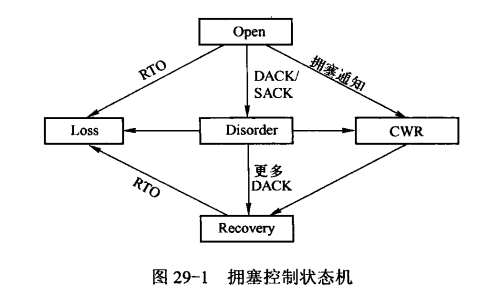
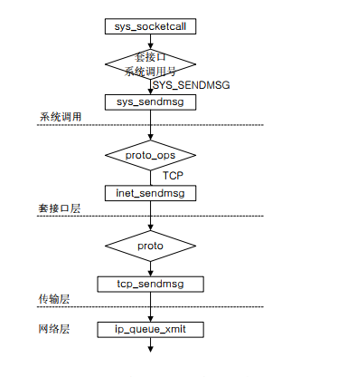

tcp基础的东西，实现算法比较复杂，慢慢分析要花大量的时间，下面有两个链接，原理性的东西已经写得很好了:
```cpp
https://coolshell.cn/articles/11564.html
https://coolshell.cn/articles/11609.html
```

代码层面没有仔细区跟踪，根据书上的内容整理一下拥塞控制的状态转移, 如下图所示:
 

先说一句：在linux2.6版本中，拥塞窗口初始值为2
open状态： 在这种状态下，tcp发送方通过优化后的快速路径来处理接收ACK。会根据cwnd和ssthresh的值来判断是采用慢启动还是拥塞避免算法

disorder状态： 发送方检测到DACK或者SACK时，将转变为disorder状态，这种状态下，只有收到一个ack才会发送一个新包

cwr状态: 发送方收到拥塞通知(ecn选项), 这种情况下，cwnd每收到一个ack就-1，直到减少到一半为止

recovery状态: 在收到3个重复的ack后，这种情况下，cwnd每收到一个ack就-1, 直到减少到ssthresh大小为止，假如进入recovery状态时，
正在发送的数据段都被成功的确认，之后恢复至open状态

loss状态: 当一个rto到期，发送方进去loss状态，cwnd设置为1, 所有正在发送的数据标记为丢失，启用慢启动算法增大拥塞窗口, 当设置为丢失
状态的数据全部得到确认以后，退回open状态


tcp的发送流程
函数调用如下图所示:
 


```cpp
int tcp_sendmsg(struct kiocb *iocb, struct sock *sk, struct msghdr *msg,
    size_t size)
{
  struct iovec *iov;
  struct tcp_sock *tp = tcp_sk(sk);
  struct sk_buff *skb;
  int iovlen, flags;
  int mss_now, size_goal;
  int err, copied;
  long timeo;

  lock_sock(sk);
  TCP_CHECK_TIMER(sk);

  flags = msg->msg_flags;
  //获取发送最大等待时间
  timeo = sock_sndtimeo(sk, flags & MSG_DONTWAIT);

  //等待socket完成连接, 只有这两种状态下，能够发送数据
  if ((1 << sk->sk_state) & ~(TCPF_ESTABLISHED | TCPF_CLOSE_WAIT))
    if ((err = sk_stream_wait_connect(sk, &timeo)) != 0)
      goto out_err;

  /* This should be in poll */
  clear_bit(SOCK_ASYNC_NOSPACE, &sk->sk_socket->flags);

  //获取当前mss
  mss_now = tcp_current_mss(sk, !(flags&MSG_OOB));
  //发送到网卡的最大段大小，假如支持tso的话，是mss的整数倍
  size_goal = tp->xmit_size_goal;

  iovlen = msg->msg_iovlen;
  iov = msg->msg_iov;
  copied = 0;

  err = -EPIPE;
  if (sk->sk_err || (sk->sk_shutdown & SEND_SHUTDOWN))
    goto do_error;

  //循环每个用户态数据快
  while (--iovlen >= 0) {
    int seglen = iov->iov_len;
    unsigned char __user *from = iov->iov_base;

    iov++;
    //单个数据块
    while (seglen > 0) {
      int copy;

      //获取最后一个skb
      skb = sk->sk_write_queue.prev;

      //假如最后一个数据块已经达到了最大分段大小，或者为空
      //则分配一个新的skb
      if (!sk->sk_send_head ||
          (copy = size_goal - skb->len) <= 0) {

new_segment:
        //假如队列中的数据已经大于发送缓存，则等待释放
        if (!sk_stream_memory_free(sk))
          goto wait_for_sndbuf;

        skb = sk_stream_alloc_pskb(sk, select_size(sk, tp),
                 0, sk->sk_allocation);
        if (!skb)
          goto wait_for_memory;

        /*
         * Check whether we can use HW checksum.
         */
        if (sk->sk_route_caps & NETIF_F_ALL_CSUM)
          skb->ip_summed = CHECKSUM_PARTIAL;

        skb_entail(sk, tp, skb);
        copy = size_goal;
      }

      ......
      //数据拷贝过程
      ......
      //假如数据全部拷贝完，跳到goto去处理
      if ((seglen -= copy) == 0 && iovlen == 0)
        goto out;

      //如果数据小于mss或者是紧急数据，继续复制
      if (skb->len < mss_now || (flags & MSG_OOB))
        continue;

      //如果缓存的数据达到一半窗口以上，则立即发送
      if (forced_push(tp)) {
        tcp_mark_push(tp, skb);
        __tcp_push_pending_frames(sk, tp, mss_now, TCP_NAGLE_PUSH);
      //如果只有这个帧，则调用tcp_push_one发送
      } else if (skb == sk->sk_send_head)
        tcp_push_one(sk, mss_now);
      continue;

wait_for_sndbuf:
      set_bit(SOCK_NOSPACE, &sk->sk_socket->flags);
wait_for_memory:
      if (copied)
        tcp_push(sk, tp, flags & ~MSG_MORE, mss_now, TCP_NAGLE_PUSH);

      if ((err = sk_stream_wait_memory(sk, &timeo)) != 0)
        goto do_error;

      mss_now = tcp_current_mss(sk, !(flags&MSG_OOB));
      size_goal = tp->xmit_size_goal;
    }
  }

out:
  if (copied)
    tcp_push(sk, tp, flags, mss_now, tp->nonagle);
  TCP_CHECK_TIMER(sk);
  release_sock(sk);
  return copied;

do_fault:
  if (!skb->len) {
    if (sk->sk_send_head == skb)
      sk->sk_send_head = NULL;
    __skb_unlink(skb, &sk->sk_write_queue);
    sk_stream_free_skb(sk, skb);
  }

do_error:
  if (copied)
    goto out;
out_err:
  err = sk_stream_error(sk, flags, err);
  TCP_CHECK_TIMER(sk);
  release_sock(sk);
  return err;
}

void __tcp_push_pending_frames(struct sock *sk, struct tcp_sock *tp,
             unsigned int cur_mss, int nonagle)
{
  struct sk_buff *skb = sk->sk_send_head;

  if (skb) {
    if (tcp_write_xmit(sk, cur_mss, nonagle))
      tcp_check_probe_timer(sk, tp);
  }
}

static int tcp_write_xmit(struct sock *sk, unsigned int mss_now, int nonagle)
{
  struct tcp_sock *tp = tcp_sk(sk);
  struct sk_buff *skb;
  unsigned int tso_segs, sent_pkts;
  int cwnd_quota;
  int result;

  /* If we are closed, the bytes will have to remain here.
   * In time closedown will finish, we empty the write queue and all
   * will be happy.
   */
  if (unlikely(sk->sk_state == TCP_CLOSE))
    return 0;

  sent_pkts = 0;

  /* Do MTU probing. */
  //路径发现
  if ((result = tcp_mtu_probe(sk)) == 0) {
    return 0;
  } else if (result > 0) {
    sent_pkts = 1;
  }

  while ((skb = sk->sk_send_head)) {
    unsigned int limit;

    tso_segs = tcp_init_tso_segs(sk, skb, mss_now);
    BUG_ON(!tso_segs);

    //检测拥塞窗口，为0则不再发送
    cwnd_quota = tcp_cwnd_test(tp, skb);
    if (!cwnd_quota)
      break;

    //检测发送的数据是否在滑动窗口内，不在的话，不会发送
    if (unlikely(!tcp_snd_wnd_test(tp, skb, mss_now)))
      break;

    //nagle算法检测
    if (tso_segs == 1) {
      if (unlikely(!tcp_nagle_test(tp, skb, mss_now,
                 (tcp_skb_is_last(sk, skb) ?
                  nonagle : TCP_NAGLE_PUSH))))
        break;
    } else {
      if (tcp_tso_should_defer(sk, tp, skb))
        break;
    }

    limit = mss_now;
    if (tso_segs > 1) {
      limit = tcp_window_allows(tp, skb,
              mss_now, cwnd_quota);

      if (skb->len < limit) {
        unsigned int trim = skb->len % mss_now;

        if (trim)
          limit = skb->len - trim;
      }
    }

    if (skb->len > limit &&
        unlikely(tso_fragment(sk, skb, limit, mss_now)))
      break;

    //记录当前的时间戳，用于计算RTT
    TCP_SKB_CB(skb)->when = tcp_time_stamp;

    //调用底层接口发送, 参数代表需要拷贝skb，因为网卡在发送完数据以后
    //会调用软中断释放这个报文，但是tcp需要确认以后才释放
    if (unlikely(tcp_transmit_skb(sk, skb, 1, GFP_ATOMIC)))
      break;

    //更新发送序号,以及sk_send_head
    update_send_head(sk, tp, skb);

    //更新最后一个小包的发送序号
    tcp_minshall_update(tp, mss_now, skb);
    sent_pkts++;
  }

  if (likely(sent_pkts)) {
    tcp_cwnd_validate(sk, tp);
    return 0;
  }
  return !tp->packets_out && sk->sk_send_head;
}
```

获取当前mss长度

```cpp

unsigned int tcp_current_mss(struct sock *sk, int large_allowed)
{
  struct tcp_sock *tp = tcp_sk(sk);
  //获取路由缓存
  struct dst_entry *dst = __sk_dst_get(sk);
  u32 mss_now;
  u16 xmit_size_goal;
  int doing_tso = 0;

  //获取之前的mss缓存
  mss_now = tp->mss_cache;

  //判断是否支持tso
  if (large_allowed && sk_can_gso(sk) && !tp->urg_mode)
    doing_tso = 1;

  if (dst) {
    //获取路由的mss
    u32 mtu = dst_mtu(dst);
    //假如和路径发现的不相等, 同步mtu，基本mtu设置为路由mtu
    if (mtu != inet_csk(sk)->icsk_pmtu_cookie)
      mss_now = tcp_sync_mss(sk, mtu);
  }

  if (tp->rx_opt.eff_sacks)
    mss_now -= (TCPOLEN_SACK_BASE_ALIGNED +
          (tp->rx_opt.eff_sacks * TCPOLEN_SACK_PERBLOCK));

#ifdef CONFIG_TCP_MD5SIG
  if (tp->af_specific->md5_lookup(sk, sk))
    mss_now -= TCPOLEN_MD5SIG_ALIGNED;
#endif

  xmit_size_goal = mss_now;

  //如果支持tso，设置xmit_size_goal为mss的整数倍
  if (doing_tso) {
    xmit_size_goal = (65535 -
          inet_csk(sk)->icsk_af_ops->net_header_len -
          inet_csk(sk)->icsk_ext_hdr_len -
          tp->tcp_header_len);

    if (tp->max_window &&
        (xmit_size_goal > (tp->max_window >> 1)))
      xmit_size_goal = max((tp->max_window >> 1),
               68U - tp->tcp_header_len);

    xmit_size_goal -= (xmit_size_goal % mss_now);
  }
  tp->xmit_size_goal = xmit_size_goal;

  return mss_now;
}
```

路径mtu，ack包窗口更新等，比较复杂，不想写了......
路径发现: http://blog.csdn.net/u011130578/article/details/44629265
