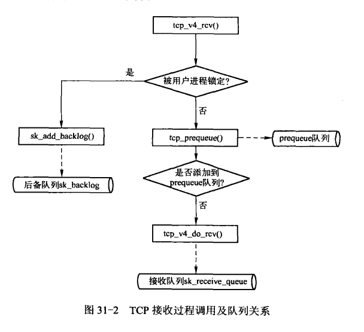
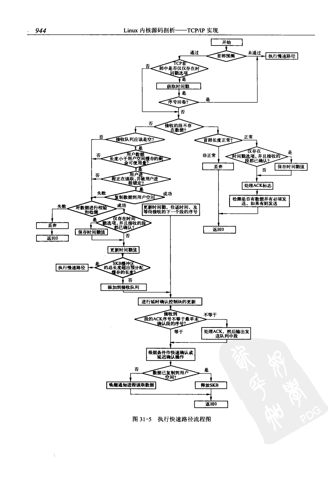
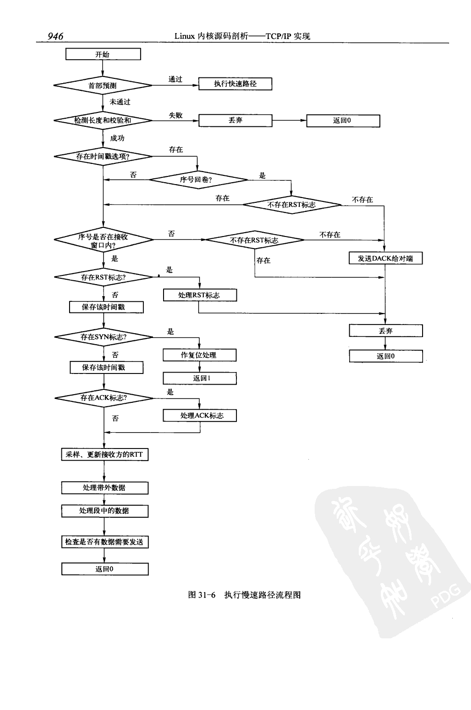
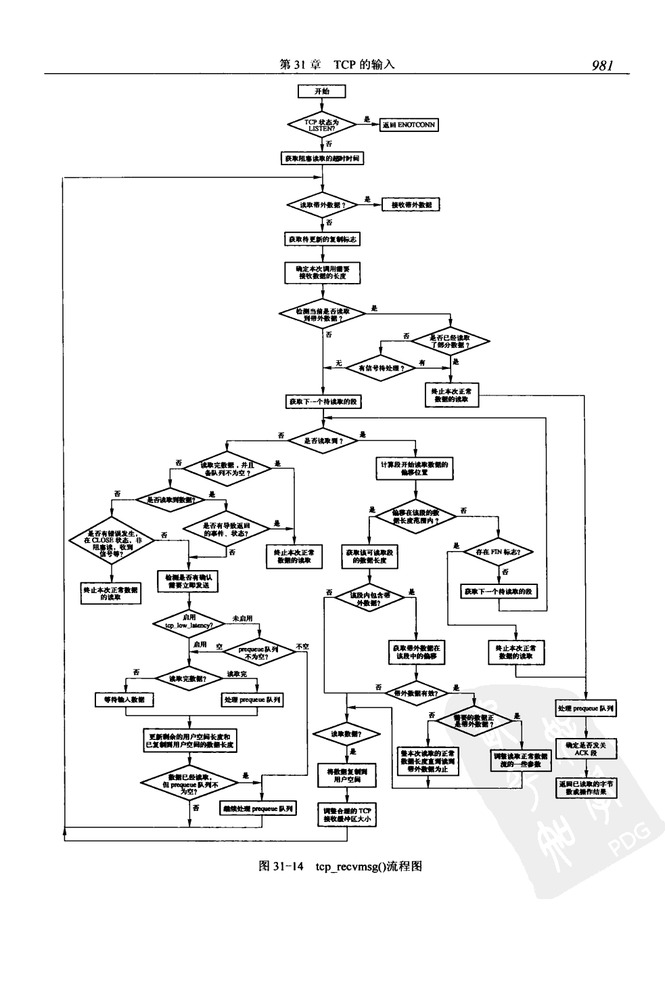

内核tcp接收过程如下图所示:
 

tcp有个内核选项tcp_low_latency, 在开启这个选项时，软中断只负责把数据段拷贝到tcp的接收队列就停止工作;
关闭选项时，软中断首先把数据段拷贝到prequeue，然后立即处理prequue中的数据段，如果用户正在调用recv系统调用，
并且数据段总长大于缓冲区长度时，则把数据段拷贝到用户空间的缓存区中;
无论是否开启tcp_low_latency，在用户进程因为操作传输控制块而将其锁定时，都会将数据段添加到后备队列中。

只有数据段添加到接收队列，才会受接收缓存大小的限制，在软中断的数据会大于接收缓存

报文过滤: setsockopt来安装，规则可以通过tcpdump -dd生成, 只有满足这个规则，才会上报给用户态
```cpp
  setsockopt(s, SOL_SOCKET, SO_ATTACH_FILTER, &Filter, sizeof(Filter));
```

tcp段的接收进一步分为两种路径：
1 快速路径: 用于处理预期，理想情形下的输入段。在正常情况下，tcp连接最常见的情形应该被尽可能地检测并最优化处理，
而无需去检测一些边缘的情形。
2 慢速路径： 用于所有和预期，理想不对应的，且需要进行进一步处理的段。

首部预测用来区分这两种接收途径，对于接收来说，如果满足以下条件，则进入快速处理:
1 下一个期待接收的数据段就是这个
2 缓存乱序队列为空(tcp有个乱序队列，专门处理各种因为延迟，丢包等网络异常没有顺序到达的包)
3 接收窗口不为0
4 当前已使用的接收缓存未到达上限
5 没有接收到紧急指针

快速路径流程如下所示:
 

慢速路径如下所示:
 


tcp_recvmsg函数调用流程
 

