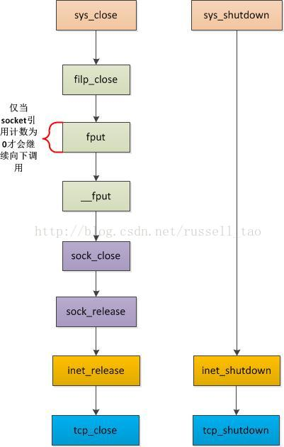
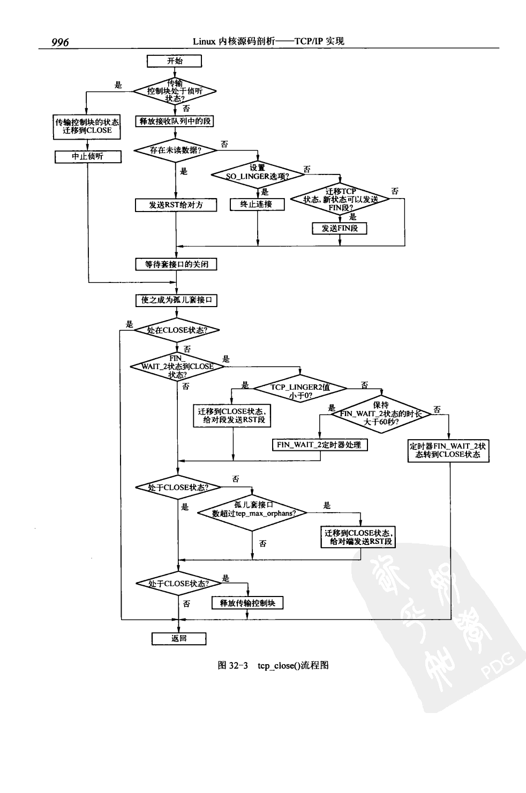

调用close到最后协议栈函数，流程如下：

 

进入协议栈以后，对于tcp来说，会调用tcp_close函数，其流程是：
 

具体的函数流程:
```cpp
void tcp_close(struct sock *sk, long timeout)
{
  struct sk_buff *skb;
  int data_was_unread = 0;
  int state;

  lock_sock(sk);
  sk->sk_shutdown = SHUTDOWN_MASK;

  //假如是listen状态
  if (sk->sk_state == TCP_LISTEN) {
    tcp_set_state(sk, TCP_CLOSE);

    //先释放半连接状态，放松reset，然后正常关闭全连接队列中的所有连接
    inet_csk_listen_stop(sk);

    goto adjudge_to_death;
  }

  //假如有数据没有读取
  while ((skb = __skb_dequeue(&sk->sk_receive_queue)) != NULL) {
    u32 len = TCP_SKB_CB(skb)->end_seq - TCP_SKB_CB(skb)->seq -
        skb->h.th->fin;
    data_was_unread += len;
    __kfree_skb(skb);
  }

  sk_stream_mem_reclaim(sk);
  if (data_was_unread) {
    //发送reset包
    NET_INC_STATS_USER(LINUX_MIB_TCPABORTONCLOSE);
    tcp_set_state(sk, TCP_CLOSE);
    tcp_send_active_reset(sk, GFP_KERNEL);
  //假如设置了SOCK_LNGER, 并且时间为0，
  } else if (sock_flag(sk, SOCK_LINGER) && !sk->sk_lingertime) {
    //清除定时器, 释放内存等操作
    sk->sk_prot->disconnect(sk, 0);
    NET_INC_STATS_USER(LINUX_MIB_TCPABORTONDATA);
  //其余情况, 根据旧状态转变为新装态，并且发送fin包
  } else if (tcp_close_state(sk)) {
    tcp_send_fin(sk);
  }

  //在发送ret或者fin包过去以后，等待tcp状态变为FIN_WAIT_1, CLOSING, LAST_ACK状态
  //如果超时时间为0，则直接返回
  //close调用也不是同步调用?
  sk_stream_wait_close(sk, timeout);

adjudge_to_death:
  state = sk->sk_state;
  sock_hold(sk);
  //设置sock DEAD标志
  sock_orphan(sk);
  //增加系统孤儿套接字的个数
  atomic_inc(sk->sk_prot->orphan_count);

  //释放backlog中的数据
  release_sock(sk);


  local_bh_disable();
  bh_lock_sock(sk);
  BUG_TRAP(!sock_owned_by_user(sk));

  if (state != TCP_CLOSE && sk->sk_state == TCP_CLOSE)
    goto out;

  //处于tcp_fin_wait2状态， linger2选项用于设置fin_wait2状态的超时时间
  if (sk->sk_state == TCP_FIN_WAIT2) {
    struct tcp_sock *tp = tcp_sk(sk);
    if (tp->linger2 < 0) {
      tcp_set_state(sk, TCP_CLOSE);
      tcp_send_active_reset(sk, GFP_ATOMIC);
      NET_INC_STATS_BH(LINUX_MIB_TCPABORTONLINGER);
    } else {
      const int tmo = tcp_fin_time(sk);

      if (tmo > TCP_TIMEWAIT_LEN) {
        inet_csk_reset_keepalive_timer(sk,
            tmo - TCP_TIMEWAIT_LEN);
      } else {
        tcp_time_wait(sk, TCP_FIN_WAIT2, tmo);
        goto out;
      }
    }
  }
  if (sk->sk_state != TCP_CLOSE) {
    //sk不是处于TCP_CLOSE状态，并且系统中孤儿sk太多，或者tcp内存占用过多，
    //发送ret包
    sk_stream_mem_reclaim(sk);
    if (atomic_read(sk->sk_prot->orphan_count) > sysctl_tcp_max_orphans ||
        (sk->sk_wmem_queued > SOCK_MIN_SNDBUF &&
         atomic_read(&tcp_memory_allocated) > sysctl_tcp_mem[2])) {
      if (net_ratelimit())
        printk(KERN_INFO "TCP: too many of orphaned "
               "sockets\n");
      tcp_set_state(sk, TCP_CLOSE);
      tcp_send_active_reset(sk, GFP_ATOMIC);
      NET_INC_STATS_BH(LINUX_MIB_TCPABORTONMEMORY);
    }
  }

  //如果这个状态是TCP_CLOSE, 则删除这个套接字
  if (sk->sk_state == TCP_CLOSE)
    inet_csk_destroy_sock(sk);

out:
  bh_unlock_sock(sk);
  local_bh_enable();
  sock_put(sk);
}
```

后续的fin包接收，首先进入tcp_rcv_established函数，假如前面所有的数据都接收完了，
则调用tcp_fin处理，否则，放入乱序队列中，等待所有数据都接收完了以后再处理

```cpp
static void tcp_fin(struct sk_buff *skb, struct sock *sk, struct tcphdr *th)
{
  struct tcp_sock *tp = tcp_sk(sk);

  //设置调度标志
  inet_csk_schedule_ack(sk);

  
  //关闭读端
  sk->sk_shutdown |= RCV_SHUTDOWN;
  sock_set_flag(sk, SOCK_DONE);

  switch (sk->sk_state) {
    case TCP_SYN_RECV:
    case TCP_ESTABLISHED:
      /* Move to CLOSE_WAIT */
      tcp_set_state(sk, TCP_CLOSE_WAIT);
      //设置延迟确认标志
      inet_csk(sk)->icsk_ack.pingpong = 1;
      break;

    //重复fin包
    case TCP_CLOSE_WAIT:
    case TCP_CLOSING:
      /* Received a retransmission of the FIN, do
       * nothing.
       */
      break;
    case TCP_LAST_ACK:
      /* RFC793: Remain in the LAST-ACK state. */
      break;

    //发送ack，进入closing状态
    case TCP_FIN_WAIT1:
      /* This case occurs when a simultaneous close
       * happens, we must ack the received FIN and
       * enter the CLOSING state.
       */
      tcp_send_ack(sk);
      tcp_set_state(sk, TCP_CLOSING);
      break;
    //发送ack，进入time_wait状态
    case TCP_FIN_WAIT2:
      /* Received a FIN -- send ACK and enter TIME_WAIT. */
      tcp_send_ack(sk);
      tcp_time_wait(sk, TCP_TIME_WAIT, 0);
      break;
    default:
      /* Only TCP_LISTEN and TCP_CLOSE are left, in these
       * cases we should never reach this piece of code.
       */
      printk(KERN_ERR "%s: Impossible, sk->sk_state=%d\n",
             __FUNCTION__, sk->sk_state);
      break;
  };

  /* It _is_ possible, that we have something out-of-order _after_ FIN.
   * Probably, we should reset in this case. For now drop them.
   */
  __skb_queue_purge(&tp->out_of_order_queue);
  if (tp->rx_opt.sack_ok)
    tcp_sack_reset(&tp->rx_opt);
  sk_stream_mem_reclaim(sk);

  //唤醒异步等待进程
  if (!sock_flag(sk, SOCK_DEAD)) {
    sk->sk_state_change(sk);

    /* Do not send POLL_HUP for half duplex close. */
    if (sk->sk_shutdown == SHUTDOWN_MASK ||
        sk->sk_state == TCP_CLOSE)
      sk_wake_async(sk, 1, POLL_HUP);
    else
      sk_wake_async(sk, 1, POLL_IN);
  }
}
```

与ack接收相关的函数是tcp_rcv_state_process函数
fin_wait2和time_wait状态下，数据接收在tcp_v4_rcv中处理

time_wait状态处理，下面的一篇文章写得比较详细:
```cpp
http://simohayha.iteye.com/blog/566980
```
