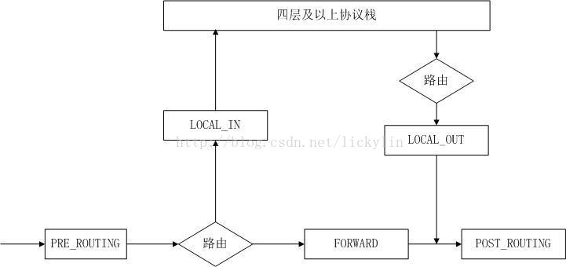
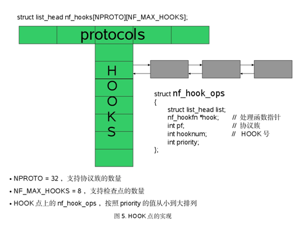
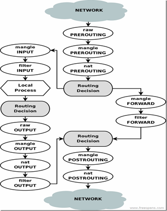

netfilter包括filter, conntrack, nat, mangle, raw, security 六张表以及LOCAL_IN, LOCAL_OUT, PRE_ROUTING, FORWARD, POST_ROUTING五个hook点组成
hook点如下所示： 在一个包在路由之前，转发，进入四层协议栈，从四层发往三层，路由之后这几个点，分别调用注册的函数

 

所有的hook通过一个数组保存，netfilter的表对这个hook点感兴趣的话，会调用nf_register_hooks注册一个回调函数，这个回调函数也有优先级,
根据优先级由小到大链接起来，注册函数如下：
```
struct list_head nf_hooks[NPROTO][NF_MAX_HOOKS] __read_mostly;
EXPORT_SYMBOL(nf_hooks);
static DEFINE_SPINLOCK(nf_hook_lock);

int nf_register_hook(struct nf_hook_ops *reg)
{
  struct list_head *i;

  spin_lock_bh(&nf_hook_lock);
  list_for_each(i, &nf_hooks[reg->pf][reg->hooknum]) {
    if (reg->priority < ((struct nf_hook_ops *)i)->priority)
      break;
  }
  list_add_rcu(&reg->list, i->prev);
  spin_unlock_bh(&nf_hook_lock);

  synchronize_net();
  return 0;
}
```

最终的数据结构如下图所示:
 


对于filter表，注册的hook点为：NF_IP_LOCAL_IN、NF_IP_FORWARD、NF_IP_LOCAL_OUT
```
static struct nf_hook_ops ipt_ops[] = {
  {
    .hook   = ipt_hook,
    .owner    = THIS_MODULE,
    .pf   = PF_INET,
    .hooknum  = NF_IP_LOCAL_IN,
    .priority = NF_IP_PRI_FILTER,
  },
  {
    .hook   = ipt_hook,
    .owner    = THIS_MODULE,
    .pf   = PF_INET,
    .hooknum  = NF_IP_FORWARD,
    .priority = NF_IP_PRI_FILTER,
  },
  {
    .hook   = ipt_local_out_hook,
    .owner    = THIS_MODULE,
    .pf   = PF_INET,
    .hooknum  = NF_IP_LOCAL_OUT,
    .priority = NF_IP_PRI_FILTER,
  },
};
```

nat 注册的hook点为: NF_IP_PRE_ROUTING,  NF_IP_POST_ROUTING, NF_IP_LOCAL_OUT, NF_IP_LOCAL_IN
```
static struct nf_hook_ops nf_nat_ops[] = {
  /* Before packet filtering, change destination */
  {
    .hook   = nf_nat_in,
    .owner    = THIS_MODULE,
    .pf   = PF_INET,
    .hooknum  = NF_IP_PRE_ROUTING,
    .priority = NF_IP_PRI_NAT_DST,
  },
  /* After packet filtering, change source */
  {
    .hook   = nf_nat_out,
    .owner    = THIS_MODULE,
    .pf   = PF_INET,
    .hooknum  = NF_IP_POST_ROUTING,
    .priority = NF_IP_PRI_NAT_SRC,
  },
  /* After conntrack, adjust sequence number */
  {
    .hook   = nf_nat_adjust,
    .owner    = THIS_MODULE,
    .pf   = PF_INET,
    .hooknum  = NF_IP_POST_ROUTING,
    .priority = NF_IP_PRI_NAT_SEQ_ADJUST,
  },
  /* Before packet filtering, change destination */
  {
    .hook   = nf_nat_local_fn,
    .owner    = THIS_MODULE,
    .pf   = PF_INET,
    .hooknum  = NF_IP_LOCAL_OUT,
    .priority = NF_IP_PRI_NAT_DST,
  },
  /* After packet filtering, change source */
  {
    .hook   = nf_nat_fn,
    .owner    = THIS_MODULE,
    .pf   = PF_INET,
    .hooknum  = NF_IP_LOCAL_IN,
    .priority = NF_IP_PRI_NAT_SRC,
  },
  /* After conntrack, adjust sequence number */
  {
    .hook   = nf_nat_adjust,
    .owner    = THIS_MODULE,
    .pf   = PF_INET,
    .hooknum  = NF_IP_LOCAL_IN,
    .priority = NF_IP_PRI_NAT_SEQ_ADJUST,
  },
};
```

conntrack 注册的hook点为:  NF_IP_PRE_ROUTING, NF_IP_LOCAL_OUT, NF_IP_LOCAL_IN
```
static struct nf_hook_ops ip_conntrack_ops[] = {
  {
    .hook   = ip_conntrack_defrag,
    .owner    = THIS_MODULE,
    .pf   = PF_INET,
    .hooknum  = NF_IP_PRE_ROUTING,
    .priority = NF_IP_PRI_CONNTRACK_DEFRAG,
  },
  {
    .hook   = ip_conntrack_in,
    .owner    = THIS_MODULE,
    .pf   = PF_INET,
    .hooknum  = NF_IP_PRE_ROUTING,
    .priority = NF_IP_PRI_CONNTRACK,
  },
  {
    .hook   = ip_conntrack_defrag,
    .owner    = THIS_MODULE,
    .pf   = PF_INET,
    .hooknum  = NF_IP_LOCAL_OUT,
    .priority = NF_IP_PRI_CONNTRACK_DEFRAG,
  },
  {
    .hook   = ip_conntrack_local,
    .owner    = THIS_MODULE,
    .pf   = PF_INET,
    .hooknum  = NF_IP_LOCAL_OUT,
    .priority = NF_IP_PRI_CONNTRACK,
  },
  {
    .hook   = ip_conntrack_help,
    .owner    = THIS_MODULE,
    .pf   = PF_INET,
    .hooknum  = NF_IP_POST_ROUTING,
    .priority = NF_IP_PRI_CONNTRACK_HELPER,
  },
  {
    .hook   = ip_conntrack_help,
    .owner    = THIS_MODULE,
    .pf   = PF_INET,
    .hooknum  = NF_IP_LOCAL_IN,
    .priority = NF_IP_PRI_CONNTRACK_HELPER,
  },
  {
    .hook   = ip_confirm,
    .owner    = THIS_MODULE,
    .pf   = PF_INET,
    .hooknum  = NF_IP_POST_ROUTING,
    .priority = NF_IP_PRI_CONNTRACK_CONFIRM,
  },
  {
    .hook   = ip_confirm,
    .owner    = THIS_MODULE,
    .pf   = PF_INET,
    .hooknum  = NF_IP_LOCAL_IN,
    .priority = NF_IP_PRI_CONNTRACK_CONFIRM,
  },
};
```

hook执行:
```
#define NF_HOOK(pf, hook, skb, indev, outdev, okfn) \
  NF_HOOK_THRESH(pf, hook, skb, indev, outdev, okfn, INT_MIN)

#define NF_HOOK_THRESH(pf, hook, skb, indev, outdev, okfn, thresh)         \
({int __ret;                       \
if ((__ret=nf_hook_thresh(pf, hook, &(skb), indev, outdev, okfn, thresh, 1)) == 1)\
  __ret = (okfn)(skb);                   \
__ret;})

static inline int nf_hook_thresh(int pf, unsigned int hook,
         struct sk_buff **pskb,
         struct net_device *indev,
         struct net_device *outdev,
         int (*okfn)(struct sk_buff *), int thresh,
         int cond)
{
  if (!cond)
    return 1;
#ifndef CONFIG_NETFILTER_DEBUG
  if (list_empty(&nf_hooks[pf][hook]))
    return 1;
#endif
  return nf_hook_slow(pf, hook, pskb, indev, outdev, okfn, thresh);
}


/* Returns 1 if okfn() needs to be executed by the caller,
 * -EPERM for NF_DROP, 0 otherwise. */
int nf_hook_slow(int pf, unsigned int hook, struct sk_buff **pskb,
     struct net_device *indev,
     struct net_device *outdev,
     int (*okfn)(struct sk_buff *),
     int hook_thresh)
{
  struct list_head *elem;
  unsigned int verdict;
  int ret = 0;

  /* We may already have this, but read-locks nest anyway */
  rcu_read_lock();

  elem = &nf_hooks[pf][hook];
next_hook:
  verdict = nf_iterate(&nf_hooks[pf][hook], pskb, hook, indev,
           outdev, &elem, okfn, hook_thresh);
  if (verdict == NF_ACCEPT || verdict == NF_STOP) {
    ret = 1;
    goto unlock;
  } else if (verdict == NF_DROP) {
    kfree_skb(*pskb);
    ret = -EPERM;
  } else if ((verdict & NF_VERDICT_MASK)  == NF_QUEUE) {
    NFDEBUG("nf_hook: Verdict = QUEUE.\n");
    if (!nf_queue(*pskb, elem, pf, hook, indev, outdev, okfn,
            verdict >> NF_VERDICT_BITS))
      goto next_hook;
  }
unlock:
  rcu_read_unlock();
  return ret;
}

unsigned int nf_iterate(struct list_head *head,
      struct sk_buff **skb,
      int hook,
      const struct net_device *indev,
      const struct net_device *outdev,
      struct list_head **i,
      int (*okfn)(struct sk_buff *),
      int hook_thresh)
{
  unsigned int verdict;

  /*
   * The caller must not block between calls to this
   * function because of risk of continuing from deleted element.
   */
  list_for_each_continue_rcu(*i, head) {
    struct nf_hook_ops *elem = (struct nf_hook_ops *)*i;

    if (hook_thresh > elem->priority)
      continue;

    /* Optimization: we don't need to hold module
                   reference here, since function can't sleep. --RR */
    verdict = elem->hook(hook, skb, indev, outdev, okfn);
    if (verdict != NF_ACCEPT) {
#ifdef CONFIG_NETFILTER_DEBUG
      if (unlikely((verdict & NF_VERDICT_MASK)
              > NF_MAX_VERDICT)) {
        NFDEBUG("Evil return from %p(%u).\n",
                elem->hook, hook);
        continue;
      }
#endif
      if (verdict != NF_REPEAT)
        return verdict;
      *i = (*i)->prev;
    }
  }
  return NF_ACCEPT;
}
```
单个连接返回值详解：
NF_DROP：直接drop掉这个数据包；
NF_ACCEPT：数据包通过了挂载点的所有规则；
NF_REPEAT：为netfilter的一个内部判定结果，需要重复该条规则的判定，直至不为NF_REPEAT；
NF_STOP：数据包通过了挂载点的所有规则。但与NF_ACCEPT不同的一点时，当某条规则的判定结果为NF_STOP，那么可以直接返回结果NF_STOP，无需进行后面的判定了。而NF_ACCEPT需要所以的规则都为ACCEPT，才能返回NF_ACCEPT。

对于单个hook点，都会有多个表注册，在单个表中的所有rule，只要一个规则满足，就不会接下去执行了
但是对于单个hook来说，只有所有表为accept才认为可以通过，当然遇到drop， stop则停止

各个table的优先顺序如下图所示, conntrack表后续再将：
 

iptables -A INPUT -j ACCEPT -s 123.125.114.144
iptables -t nat -A OUTPUT -d 114.114.114.114 -j DNAT --to-destination 8.8.8.8

nat的实现，在进入路由之前进行dnat操作
在出路由以后，再进行snat操作

# lvs实现原理

 //lvs 只会转发这几种icmp类型
 if ((ic->type != ICMP_DEST_UNREACH) &&
     (ic->type != ICMP_SOURCE_QUENCH) &&
     (ic->type != ICMP_TIME_EXCEEDED)) {


//处理dnat模式下，回包
static struct nf_hook_ops ip_vs_out_ops = {
 .hook  = ip_vs_out,
 .owner  = THIS_MODULE,
 .pf  = PF_INET,
// FORWARD点
 .hooknum        = NF_IP_FORWARD,
// 此优先级低于filter
 .priority       = 100,
};

//主要处理
static struct nf_hook_ops ip_vs_in_ops = {
 .hook  = ip_vs_in,
 .owner  = THIS_MODULE,
 .pf  = PF_INET,
// INPUT点
 .hooknum        = NF_IP_LOCAL_IN,
// 此优先级低于filter
 .priority       = 100,
};

//仅仅返回NF_STOP， 让后面的netfilter规则不再处理
static struct nf_hook_ops ip_vs_post_routing_ops = {
 .hook  = ip_vs_post_routing,
 .owner  = THIS_MODULE,
 .pf  = PF_INET,
// POSTROUTING点
 .hooknum        = NF_IP_POST_ROUTING,
// 在源NAT之前进行
 .priority       = NF_IP_PRI_NAT_SRC-1,
};


lvs state 处于tcp established 状态的会设置ACTIVE统计
处于非tcp established状态的会设置INACTIVE统计，
对于tcp来说，每种状态的超时时间都不一样
